# Flights Pipeline
This mono-repo holds infra & multiple services for the flights processing pipeline which collects, stores, and processes flight trajectories and simulates contrail generation and evolution for the flight trajectories.
Each service is managed and deployed independently.
The service topology, constituting the overall flights pipeline, is outlined here.

## Overview of the Repository
* [.cloud](./.cloud): terraform infrastructure as code defining k8s deployments, PostgreSQL databases, Redis cache, firestore, PubSub, BigQuery, Log sinks, artifact repository, and alerts for the flights pipeline services.
* [.github](./.github): CI/CD for the flights-pipeline services. Deploys dev and prod versions of k8s deployments.
* [bq-to-postgres-util](#bq-to-postgres-util): Utility to export flights-pipeline results to Postgres to back the [Impact Explorer](https://explore.contrails.org/explorer).
* [inventory-cache](./inventory-cache): This service is no longer in use. An service to automatically export new flights-pipeline runs from BigQuery to Postgres in near real time. This service is no longer in use, and now we use hte manual `bq-to-postgres-util` for the same purpose for periodic (quarterly) data export.
* [pipeline-cli](./pipeline-cli) CLI tooling used to generate batches of ADS-B trajectories to run through the flights-pipeline.
* [pipeline-playbook](./pipeline-playbook/) Instructions, tooling, and notes for preparing, running, and post-processing flights-pipline runs.
* [pdsb-contrails-default-gateway](./psdb-contrails-default-proxy/): Not in use. A k8s service to allow k8s services to access the Postgres instances.
* [spire-cache-heater](#spire-cache-heater): a tool to ensure the GCS Spire cache is full before running flights-pipeline with that as a data source.
* [spire-ingest-api-scraper](#spire-ingest-api-scraper): An ETL service that fetches and stores global ADS-B data from Spire.
* [spire-raw-batch](./spire-raw-batch/): Another lightweight ETL service that fetches global ADS-B data on a 5-minute period and stores the results in Parquet files in a GCS bucket.
* [trajectory-worker](#trajectory-worker-tw): GKE service that runs per-trajectory CoCiP and stores results.
* [trajectory-worker-job-factory](#trajectory-worker-job-factory-twjf): GKE service that picks up job description batches and processes Spire flight trajectories for each batch, cleaning trajectories, and ejecting bad trajectories, while passing good trajectories along to be processed by the [trajectory-worker](#trajectory-worker-tw).


## Description of Services
### Spire Ingest API Scraper
The Spire Ingest API Scraper is an ETL service which fetches and stores global ADS-B positional information, 
specifically the telemetry information (position and time) for every aircraft in the world.

The frequency of telemetry data is highly heterogeneous, meaning the positional information 
for a given flight will at times be reported as frequently as once-per-second,
and at other times at intervals of several hours. This heterogeneity is primarily due 
to the spatial density, or lack thereof, of ADS-B receivers.  There tend to be many ADS-B receivers 
in the vicinity of airports and other dense urban areas, thus telemetry
data density tends to be high in these areas. Conversely, data is sparse over oceans 
(where ADS-B telemetry data generally arrives via satellite feeds, of which there are few).
Concerns regarding data availability are addressed downstream 
(look for references to this issue in the description of downstream services).

This service is deployed as a kubernetes CronJob that executes on a 5min schedule. 
On each execution, the service fetches a 5-minute window (in 5 async fetches of 1 min intervals) 
from Spire (an ADS-B data provider with whom Contrails.org has a contract).

If data is retrieved successfully, some minor transformations are performed on the dataset.
Those transformations include but are not limited to:
- removing records with no reported barometric altitude
- removing records reported to be on-ground
- removing records associated with known phony or irrelevant icao address designators (e.g. balloons)
- subsampling records to a best-effort 30-second interval on a per icao address basis
- minifying the data model to retain a [subset of available ADS-B data fields](.cloud/schemas/bq_spire_flights_raw.json)

Note that the icao address designator (tied to the aircraft's transponder hardware address) 
is generally taken to be the most robust indicator of a commercial aircraft's identity throughout this system.
A reader will often see groupings of records by this designator to associate a collection of telemetry records 
with a given aircraft entity. Other aircraft identifiers (e.g. tail number) have been observed to be less consistent and less available in the Spire ADS-B telemetry dataset.

After transformations are complete, records are published to a queue which drains into the GCP BigQuery (BQ) table `spire_flights_raw_prod` (with daily partitions on record `timestamp`).
That BQ table serves as the system's source-of-truth (SOT) for aircraft telemetry data, and uses [this schema](.cloud/schemas/bq_spire_flights_raw.json).

**Load**

A 5-minute window of global telemetry data as received from the Spire API contains on average approx. 
2M records. After transformations, approx. 150k are written to the BQ table. This ~10x decrease in load
is primarily due to the 30-second subsampling of records on a per icao address basis.

**Behavioral Dynamics**

The Spire ADS-B API permits windowing on the record's `ingestion_time`, _not_ on the ADS-B record's `timestamp`.
Here, `ingestion_time` refers to the time at which the record arrives at Spire's servers.

This behavior makes it challenging to optimally set compute resource constraints on this service.

If Spire's API permitted windowing on a `timestamp` basis, each 5-min window would be proportional 
to global air traffic load during that 5-min window, 
which over all time could be bound by reasonable upper and lower limits following diurnal and seasonal trends.

With an `ingestion_time` windowing, we observe windows with low record numbers due to backups in Spire's internal 
processing, followed by a massive influx of records in a later window when service is restored and backlogged 
records in their system are successfully ingested. This bursty behavior can result in OOM occurrences in this service.

**Failure Management**

This service uses a progress marker to guarantee contiguous data capture from the Spire API.
The progress marker is a timestamp document record in GCP Firestore.

On each invocation of this service, the service first retrieves the last successful completion timestamp,
and iterates forward in 5-minute intervals starting at that last known point of success.
On successful completion of each 5-minute iteration of work, the progress marker is incremented forward.

Almost every failure scenario results in this progress marker not advancing. 
Once remediation is complete & expected behavior is restored, 
the service heals itself as it forward steps and advances towards the present.

The average execution time of a 5-minute unit of work is approximately 2.5 minutes.  Thus, typical service 
catch-up takes approximately the same period of time as elapsed during incident remediation.

**Logging, Monitoring, Alerting**

Application logs are written to GCP Cloud Logging.
Monitoring and alerting is handled with GCP Monitoring and Alerts. 
See [HERE](.cloud/alerts.tf) for metrics & alerts (prefix: `k8scronjob_spire_ingest_api_scraper_*`).

Notable alerts include:
- Application logs observed with `ERROR` severity
- Progress marker timestamp has fallen behind (indicative of consecutive failures of the service and larger system issues)

### Trajectory Worker Job Factory (TWJF)
The Trajectory Worker Job Factory is responsible for minting units of work for the Trajectory Worker (TW).
Specifically, the TWJF will ingest target ADS-B telemetry data, group the telemetry data into flight instances,
apply QA/QC processing, and finally publish the flight data for consumption by the TW.

The TWJF a kubernetes deployment that ingests Trajectory Worker Job Descriptors (TWJD) messages from a queue, 
each TWJD representing an instruction set for an invocation of the TWJF - a batch of flight trajectories. 
The TWJF deployment scales horizontally based on queue depth of TWJDs.

The anatomy of a TWJD is described in the [Running the Flights Pipeline Section](#running-the-flights-pipeline), 
as the combinations of ways in which a TWJD are composed dictate overall system behavior.

The TWJD, loosely:
1. specifies a grouping criteria for bundling multiple flights (these are instructions for the TWJF)
2. specifies the source from which to fetch ADS-B telemetry data (these are instructions for the TWJF)
3. specifies the source from which to fetch meteorological data (these instructions are forwarded to the TW)
4. specifies other runtime parameters which dictate how the CoCiP model is run and how data is persisted downstream (these instructions are forwarded to the TW)

When a TWJF receives a TWJD, it first fetches those ADS-B telemetry data that overlap with the flights specified in the grouping criteria of `(1)` above.
It fetches ADS-B from either the BigQuery source-of-truth table, or from a cache of Parquet files in Google Cloud Storage (GCS).
For development and small production runs, it is common to run the flights pipeline using the configuration that fetches ADS-B from BQ, 
as this is our SOT dataset and there are fewer transaction which could result in system issues. For production runs, however, 
pulling ADS-B from BQ is costly. Whilst the BQ table is partitioned by timestamp (daily)
and callers only pay for the number of partitions traversed in a query,
any given TWJD will only concern itself with a slice of a day's partition (i.e. many TWJDs hitting a day's partition).
TWJDs are designed this way in an attempt to keep the size of a unit-of-work manageable and create flexibility in scale of concurrency (and fault tolerance/blast-radius).
Thus, for production runs, it is favorable to run the pipeline instructing the TWJF to fetch ADS-B from the GCS cache (see the [Spire Cache Heater](#spire-cache-heater))

Once ADS-B records are loaded, the TWJF identifies those records in the ADS-B data 
that uniquely belong to the multiple flights in the grouping criteria of `(1)`.
The TWJF iterates over the flights in that group, and for each flight, applies a sequence of QA/QC and resampling steps.

Lastly, if the flight passes validation, it is published to the Trajectory Worker (TW) job queue.

**QA/QC Layer & Resampling**

These steps loosely follow those outlined in [this example reference](https://apidocs.contrails.org/notebooks/adsb_workflow.html).

The QA/QC layer first consists of a healing step.  Healing can be generally described as transformations applied to a flight's ADS-B telemetry data to remediate erroneous data values while preserving the flight's trajectory. 

The healing stage generally includes the following steps:
- impute invariant attributes
- prune records with anomalous speed
- interpolate to airports

*Invariant attribute imputation* is a healing step in which invariant attributes of a flight instance are imputed and masked onto the flight.
For instance, a flight may have 800 ADS-B telemetry records. Each record specifies the location (lat, lon, alt) and timestamp of the aircraft,
in addition to many attributes of the flight or aircraft.  Aside from the positional and time information, one expects all other attributes (tail number, flight number, etc...) to be invariant 
among the 800 records. Suppose, however, that of the 800 records, 
two different tail numbers are reported -- tail number `A` 650 times, tail number `B` 14 times, and no tail number (`null`) 136 times.
The invariant attribute healing step assumes that those records with the highest non-null value count (`A`) truthfully belong to the flight,
that those records belonging to the lower value counts (`B`) are records erroneously associated with the flight, and that those records with no null value 
truthfully belong to the flight.  As such, the invariant attribute healing step behavior is to retain all records with the highest priority-count (`A`), 
drop all records with a non-null non-priority-count value (`B`) and mask all unknown values (the `null` records) with the highest priority-count value (`A`).

The *prune records with anomalous speed* healing step will first compute the ground speed between consecutive flight waypoints, 
identify those waypoints adjacent to segments with a speed above or below a certain threshold, and recursively prune those waypoints, 
up to some recursion depth, attempting to prune anomalous waypoints and return all waypoints to a reasonable ground speed.

It is important to note that anomalous speed should be looked at as a symptomatic issue. The motivation for this healing step is to 
identify anomalous waypoints whose root cause may be varied, but whose symptoms uniformly manifest as unusual speed values.
For instance, it has been observed that a flight will teleport -- a few spurious waypoints will be at positions that are clearly not on the flight path.
More often, we observe what is likely "timestamp wiggle" -- poorly calibrated timestamps on certain records, presumed to be associated with a single bad ADS-B receiver in the network.
The timestamp of an ADS-B record is _not_ the timestamp as reported by the aircraft, rather the time-of-arrival of the packet at the ADS-B receiver. As such, if an ADS-B receiver 
has a clock that is not properly sync'ed with a time-server, it will report erroneous timestamps.

Lastly, the *interpolate to airports* step will take the first and last waypoint of a trajectory, and if that waypoint  not at the expected airport, but is sufficiently close,
the healing step will interpolate and impute waypoints to/from those airports.  This is done with a great circle interpolation, at a nominal aircraft speed, 
with a nominal climb/descent from/to the airport location (as determined in a global airport lookup database, using the takeoff/landing airport reported in ADS-B).
The merit of this healing step is mostly to mint a complete trajectory from the origin airport,
as the takeoff to cruise portion of a flight is relevant for the CoCiP calculations in the Trajectory Worker. Missing takeoff data specifically impairs the aircraft performance model input to CoCiP, which models fuel burn and decrements the mass of the aircraft after takeoff. Neglecting this takeoff and climb portion biases the aircraft weight up for the remainder of the flight.
Additionally, the `flight_id` reported by Spire and used to group records and associate them with a flight instance are not particularly robust, 
and it happens from time to time that a flight instance is fractured and given two flight ids. In such cases, this healing step will help heal the head and/or tail 
of a fragmented flight if the break in the flight is close enough to takeoff or landing. If the break is in the middle of a flight, usually neither flight is completed and both are discarded. Ideally we would heal the `flight_id`s, but this is harder in practice, but remains under consideration for future improvements (likely as an upstream service).

The healing step is followed by a *resampling step*.
The flight trajectory is resampled to a 1-min segment interval, with great circle interpolation (in lat and lon) over gaps.
Altitude over gaps are imputed using a nominal rate of climb/descent, followed by level-off.

Lastly, the flight trajectory passes through a *validation step*.
The various validation rules are well-documented [HERE](https://apidocs.contrails.org/notebooks/adsb_workflow.html), 
and the implementation in this service mirrors that example reference closely.

If a flight passes the validation step, the records for the flight and some metadata/pass-thru instructions are packaged in a data transfer object 
and published to a queue, and await consumption by the Trajectory Worker, and the TWJD message is acknowledged and removed from the queue.

**Failure Management**

Two failure recovery mechanism exist for the TWJF.

First, if the TWJF exits mid-job, the TWJD message in the queue will be redelivered (up to 5 times, before dead-lettering).
If the failure scenario is transient, it is expected to succeed on subsequent redeliveries.
Note, however, that the TWJF will publish work throughout the processing of a TWJD job, resulting in duplicate jobs being published downstream 
should a TWJF fail and retry via this mechanism. This is not a critical problem, as the [Trajectory Worker](#trajectory-worker) behavior 
is deterministic (the system remains idempotent), but if the TWJD represents a large unit of work, this can result in a lot of repeated (and costly) 
work for the Trajectory Worker.

The, second failure mechanism is:
If running in GCP (not locally), the TWJF will use a progress marker (in GCP MemoryStore aka. Redis), 
which increments on each flight iteration. When the TWJF has finished all work described in the TWJD,
it will remove the progress marker from Redis. If, however, the TWJF fails and retries the TWJD via message redelivery,
it will fast-forward to the last `flight_id` for the TWJD group that had been successfully published to the TW queue.

Note that this secondary recovery mechanism should be extraneous as a core design element. 
It was implemented, however, as a means to manage a manage a transient yet prevalent and long-lived issue in GCP.
It was introduced in 2025 during a period in which instability was observed in GCP's Autopilot kubernetes clusters.
Specifically, pods of certain compute classes would, with high prevalence, exit and reboot without explanation (no OOM issues, no observable OS-level issues). 
This solution prevented a high volume of dupes (enough so to be a cost concern) from being published to the TW.

Lastly, if the TWJF fails due to permanent reasons, the TWJD will be dead-lettered.
Once the issue has been triaged and remediated, the TWJD can be reinjected from the dead-letter queue back to the work queue.

**Logging, Monitoring, Alerting**

Application logs are written to GCP Cloud Logging, and to shards of nl-delimited JSON files in GCS.
Monitoring and alerting is handled with GCP Monitoring and Alerts. 
See [HERE](.cloud/alerts.tf) for metrics & alerts (keywords: `k8sdeployment_trajectory_worker_job_factory` or `twjf`).

Notable alerts include:
- Application logs observed with `ERROR` severity
- Ingress messages (TWJDs) dead-lettered

For production runs, a captain monitors GCP metrics for TWJD ingress queue depth, 
and makes adjustments as needed to the horizontal auto-scaling limits of the TWJF deployment.

**Observability & Reproducibility**

The TWJF uses `INFO` level application logging to write-out the sequence/timeseries of transformation applied to a flight's records.
For production runs, tooling detailed in the [`pipeline-playbook`](pipeline-playbook/README.md) is used to 
load & structure the TWJF (and TW) output logs into a BQ table.
This table serves as a SOT for the data provenance as flights transit the flights-pipeline.
Specifically, for a given `flight_id`, this table of structured logs can provide the timeseries of events relevant to understanding a flight's processing throughput.
For the TWJF, each transformation event applied by the healing handler is logged, as is the end-state.
A flight can have two end states -- forwarded to the TW for CoCiP model application, or ejected due to validation handler rule violations.
If ejected, the reasons for ejection are also logged.

The lineage of each `flight_id` carries with it all relevant information (TWJD and system versioning) 
necessary to reproduce the outcomes, should demonstration of reproducibility be necessary.

### Trajectory Worker (TW)
The Trajectory Worker (TW) is a kubernetes deployment, where each pod is responsible for applying the CoCiP model (via [pycontrails](https://github.com/contrailcirrus/pycontrails)) 
to a flight trajectory.  The TW receives its work (each unit-of-work being a single flight) from the TWJF egress queue.

The implementation of CoCiP can be summarized as follows (see the `lib.handlers.py::CocipTrajectoryHandler` implementation for specifics):
- the CoCiP trajectory model is applied to the flight trajectory (not interpolation of a CoCiP grid model to the flight trajectory)
- either PSFlights or BADA3 are used for aircraft performance modelling; PSFlight being preferred if the `aircraft_type` is supported
- engine type (`engine_uid`) is selected based on a lookup of aircraft `icao_address` or `tail_number`; if not found, then a default `engine_uid` is used based on the `aircraft_type`
- default pycontrails behavior for load factors and other configs

The model will run with either ECMWF ERA5 or HRES meteorological data, based on the instruction set passed down from the TWJF.
In both cases (default behavior) the TW will load the met data as xarray objects bound to the remote ERA5 or HRES zarr stores in GCS (see [ERA5-etl service](#era5-etl-service) & [HRES-etl service](#hres-etl-service)).

If running on HRES, the TW will find the most recent HRES model run where the flight trajectory fits entirely within the single forecast dataset from that one model run (as opposed to a piece-wise approach in which the most recently available forecast times are used for each trajectory waypoint, potentially spanning multiple HRES model runs).
Note that this is a moot concern if running the TW retrospectively (outside the 72hr forecast window of HRES), as all runs of the TW configured with HRES will otherwise 
point to the zero-hour HRES model run.

The TW runs each flight trajectory in CoCiP fleet mode, where the fleet is composed of the target flight trajectory, 
as well as multiple alternative trajectories, all sharing the same lat and lon positional data, but with altitude fixed to standard flight levels. 
The collection of these alternative trajectories form a vertical grid along the flight path, showing contrail forming predictions 
at flight levels other than those in the actual flight trajectory. These data are used in the [Impact Explorer](https://explore.contrails.org/explorer?time_start=2025-01&time_end=2025-12) to show the contrail-forming regions around the flight path, and serve as a basis for future work in vertical flight optimization simulation work.

**Data Egress**

The model outputs from the TW are written to a queue, which drains into a BQ table (`trajectory_cocip_prod`).
The TW will either export a single record with the per-flight summary values or all 1-minute segments with their values.
This behavior is modulated based on the instruction-set passed down from TWJD through the TWJF. 
These outputs form the SOT for model outputs & the impact inventory backing the [Impact Explorer](https://explore.contrails.org).

Additionally, the TW will write data to a protobuf file (on a per-flight-basis), 
stored in GCS with uri format: `contrails-301217-flights-pipeline-{dev:prod}/trajectory-worker/trajectory-pq/{%Y%m%d%H}/{airline_iata}/{flight_id}.pq`.
The Protobuf definition for the blob can be found in [trajectory-worker/protos/lib/trajectory.proto](trajectory-worker/protos/lib/trajectory.proto).

The protobuf blob holds three primary data objects:

1. The flight trajectory itself, with the CoCiP impact energy forcing predictions.
Unlike those data exported to BQ, those stored in the proto blob are down-sampled to a 5-minute interval 
(with extra resolution at contrail-forming boundaries to preserve the 1-minute detail).
2. The alternative flight paths (those fixed at specific flight level altitudes) are written to the blob, with the same resampling as the target profile (preserving timestamp and vertical grid alignment).
3. The contrail evolution data is written to the blob. These data are output as multi-line segments, each multi-line being the contiguous segments of a contrail at some point in time.
These are similar to (thoough not currently the exact data backing) what is visualized in the [Contrails.org Map](https://map.contrails.org) after an aircraft creates persistent contrails and those contrails advect and evolve in time.

**Production Runs & Operational Considerations**
The execution profile for a Trajectory Worker when running a unit of work will vascillate between 
being I/O bound (during met data ingress) and CPU-bound (during model execution).
The cost of running a unit of work is loosely proportional to the flight trajectory being processed.
For longer flights, the Trajectory Worker runs the CoCiP model using the low-memory execution mode, 
which runs the model with lower memory requirements over an extended run time.
This helps maintain lower max memory allocation to the worker and higher average memory utilization
On average, with the nominal configuration of 0.4 vcpu and 0.8GiB, a unit of work is expected to complete 
in 25 seconds on a GCP c3 compute node. Meteorological data ingress averages 15 Mb/sec per worker when running from disk.

In productions runs, the meteorological data is loaded into a GCP Hyperdisk 
(see [trajectory-worker/hyperdisk-setup/README.md](trajectory-worker/hyperdisk-setup/README.md)), 
which affords high bandwidth throughput of the shared meterological data to the distributed workers.  
Similar performance is achievable when running the workers from the meteorological zarr stores in GCS buckets 
(see [hres-etl service](#hres-etl-service) and [era5-etl service](#era5-etl-service)), but cost is substantially higher 
(GCP does not bill for data transfer between GCS and GCP services in the same region, these costs _are from GCS Class B operation costs alone!_).

**Failure Management**

The most common failure mode for the TW is out-of-memory (OOM) failures of the worker.  
This happens from time to time for particularly long and/or heavy contrail-forming flights (<1%).

If a worker restarts due to OOM, the TW queue message will expire and be redelivered at a later time.
When the TW dequeues a message, it checks the redelivery count, and if the message indicates that it had 
been delivered already, that message is forwarded to a backup queue 
(why GCP PubSub does not allow for retry/redelivery-count to be set to a value less than 5, 
in which case we could use the dead-letter queue for this purpose... I do not know).

A separate/parallel deployment of the TW ("TW-backup") operates on this queue. 
The workers in this deployment run the same TW application, but provisioned with higher memory. 
Vertical autoscaling of a kubernetes deployment is not suitable for this goal, as the proportion of workers 
requiring high memory allocation to those not requiring those limits is low and temporally heterogeneous.

A typical production run will have order of 10 backup TW workers, and order of 10,000 (primary) workers.

If a job enters the backup queue fails to be processed by the TW-backup worker 5 times, it is dead-lettered. 
The dead-letter queue is monitored and inspected by a production run captain.

All other failures of the TW are expected failures, and result in `ERROR` level logs which are captured 
and structured as part of the data provenance tracking discussed below.

A TW may fail for expected reasons if, for instance, an aircraft type is 
unknown by the performance models (`PSFlight` or `BADA3`, as described above).

**Logging, Monitoring, Alerting**

Application logs are written to GCP Cloud Logging, and to shards of nl-delimited JSON files in GCS.
Monitoring and alerting is handled with GCP Monitoring and Alerts. 
See [HERE](.cloud/alerts.tf) for metrics & alerts (keywords: `k8sdeployment_trajectory_worker_gaia`).

Notable alerts include:
- Application logs observed with `ERROR` severity
- Ingress messages (TWJDs) dead-lettered

For production runs, a captain will monitor GCP metrics for TW and TW-backup ingress queue depth, 
and make adjustments as needed to the horizontal auto-scaling limits of the TW and TW-backup deployment.

**Observability & Reproducibility**

TW logs and TW Backupl logs are joined with TWJF logs (described in the TWJF section), and serve as a reference 
for chronicling the lineage of a given flight's processing through the pipeline.

### Spire Cache Heater
The Spire Cache Heater is some basic scripting used to fill in a cache of Spire ADS-B Parquet files. 
This tooling is only relevant if one expects to run the pipeline in a configuration that pulls 
ADS-B data from the GCS spire cache, rather than from the BQ SOT table 
(see discussion in [Trajectory Worker Job Factory](#trajectory-worker-job-factory-twjf) above).

The ADS-B telemetry data cache used by the TWJF is the same backing the api.contrails.org `v1/adsb/telemetry` endpoint ([REF](https://api.contrails.org/openapi#/ADS-B/adsb_telemetry_v1_adsb_telemetry_get)).
The caching strategy for this cache is opportunistic, meaning it is populated on client request if and only if it is not already present.
As such, this Spire Cache Heater is simply tooling that scan the `v1/adsb/telemetry` endpoint over a target time range, 
guaranteeing (via the API's caching behavior) that the cache exists and is contiguous over the specified range.

When doing large production runs, this is generally a pre-work step, to ensure that the cache is present and complete over the time range 
targeted in the pipeline run.

### PSDB `contrails-default` proxy
A kubernetes Deployment and Service, that proxies traffic from within the k8s cluster 
to the `contrails-default` GCP Cloud SQL postgres instance. 
GCP Cloud SQL provides two connection methods: either a socket connection, or a static IP connection (classic).
Connecting via socket URI would require intra-service networking between the k8s cluster and the Cloud SQL service, 
which seems to be unsupported by GCP official docs 
(note that this is the way that many GCP services connect to GCP Cloud SQL, but for some reason this automagic hasn't made it's way to GCP Kubernetes).
The second method, with a protected IP (as is the case with our DBs), requires allow-listing client IPs -- an approach unsuitable given the ephemeral (and local) nature of k8s pod IPs.

This proxy service exists to bridge this GCP service networking gap.

At present, this proxy is not used in the pipeline, but was created for automation of the [BQ to Postgres Util](#bq-to-postgres-util).

## BQ to Postgres Util
The BQ to Postgres Util is tooling, run locally, that selectively syncs the outputs of the flights pipeline (stored in the `trajectory-cocip-prod` BQ table) 
to the `contrails-default` postgres instance.  This util also performs some ETL augmentation to the data before loading 
to the target tables and materialized views. 
The tables and views to which these data are uploaded are those which back the [Impact Explorer](https://explore.contrails.org).


## External Services
Several other external services support the flights-pipeline, but are not part of this mono repo.
Those services are described below.

### ERA5-etl service
The ERA5 ETL service is a GCP CloudRun function (triggered by CloudSchedule) that periodically fetches 
ERA5 re-analysis meteorological modeling from ECMWF's Copernicus system.
This is done by submitting jobs to Copernicus for target times, polling the server 
until those jobs are complete, retrieving those data files, and reformatting and saving them to Zarr stores in a GCP bucket.

The ERA5 meteorological data is segregated between pressure-level variables (available at multiple `z` coordinate locations) 
and surface-level (available at a single `z` coordinate location).

Those data are stored in a zarr store in GCS, one zarr store per day period, with URI conventions:
```
# pressure level
gs://contrails-301217-ecmwf-era5-zarr-v2/{%Y%m%d}_pl.zarr
# surface level
gs://contrails-301217-ecmwf-era5-zarr-v2/{%Y%m%d}_sl.zarr
```

### HRES-etl service
The HRES ETL service is a collection of GCP services that periodically trigger, 
repackaging delivered ECMWF HRES meteorological forecasts into zarr stores in GCS.

ECMWF periodically delivers HRES forecasts as GRIB files 
(one per hour forecast slice, for the 72 forecast hours in a given model run).

The collection of 72 files trickle in over a 1hour period.  
These files arrive 4 times per day (there are 4 ECMWF forecast runs per day).
These files arrive in a GCS bucket, as per our ECMWF subscription.

A change-data-capture trigger fires on each file delivery (GCP EventArc).
EventArc places an event object into a queue (PubSub), 
which is consumed by a push subscription to a GCP Workflow instance.
The GCP Workflow instance manages a workflow diagram, which is responsibe for simply calling (w/ retries)
a CloudRun instance which performs the ETL. 
Note that EventArc (via PubSub) does permit consumption of events via a direct 
push subscription to CloudRun instances (which would remove the need for a GCP Workflow instance).
EventArc, unfortunately, does not permit configuring the timeout period for the CloudRun instance beyond 60 seconds, 
nor does it permit configuring retry and dead-lettering (failure management) configurations. As such, the extra 
complexity of the GCP Workflow instance is necessary given the limitations of integrating EventArc with CloudRun.

Lastly, the HRES ETL CloudRun instance performs ETL on the ingress GRIB files.
Processing a single GRIB file involves having a master HRES ETL CloudRun instance load that file into memory,
fan out the loaded data (on a per-variable basis) to several other instances of HRES ETL CloudRun (workers),
those workers each apply model-level to pressure-level conversions, and finally write out the transformed 
content to a GCS zarr store.

HRES data is stored in zarr stores, on a per-model-run basis, with the convention:
```
# pressure level
contrails-301217-ecmwf-hres-forecast-v2-short-term/{%Y%m%d%H}/pl.zarr

# surface level
contrails-301217-ecmwf-hres-forecast-v2-short-term/{%Y%m%d%H}/sl.zarr
```
Where `%H` is one-of `[00, 06, 12, 18]`.

Each zarr store contains 72 hours of forecasts, starting with the model run time, inclusive (which is in the timestamp in the URI).
A consumer of these stores is expected to find the store(s) that include the forecast times of interest, 
given the expectation of 72 hrs of timestamps past the model run time.

### contrails-api | `v1/adsb/telemetry`
As noted in the [Spire Cache Heater](#spire-cache-heater) section, the `api.contrails.org/v1/adsb/telemetry` endpoint 
is an important part of the flights pipeline (for production runs) in that it is used to help build the cache 
of ADS-B telemetry data as Parquet shards in GCS.

## Running the Flights Pipeline 
The flights pipeline can be run in various modes, generally covered by the following variants:
- pull ADS-B telemetry data from BigQuery or GCS cache
- run with ECMWF ERA5 or HRES meteorological data
- pull meteorological data from GCS or from Hyperdisk
- dry-run mode (run the TWJF without publishing to the TW)
- lean vs full trajectory mode -- output per-flight summary data only, or per-segment flight summary and protobuf blob objects

Trajectory Worker Job Descriptors (units of work for the Trajectory Worker Job Factory) can be specified to batch flights based on:
- airline-day (`airline_iata <> calendar_day` groupings)
- single flight identifier (`flight_id`)

The TWJF/TWJD will be expanded at a future time to accept groups of `flight_id` in a single unit-of-work, 
by either passing a list of `flight_id`s to the TWJF via TWJD, or via a remote lookup table (BigQuery) with job reference id
(which maps to that list in the lookup table).

Invoking the flights pipeline is currently done manually by a captain.

The CLI tooling in [pipeline-cli](pipeline-cli/cli.py) is used by the captain to mint and submit TWJDs to the TWJF queue.

# System Topology Diagram

```mermaid
---
title: Flights Pipeline
---
graph 
    %% style
    classDef operationStyle fill:#8f8e8c, stroke-dasharray: 5 5

    %% services/processes
    spire_api(Spire API)
    
    contrails_api(Contrails API)
    get_internal_nat_track[internal.nat.track]:::operationStyle
    
    subgraph gcs_1[Cloud Storage]
        spire_gcs_cache(bucket: contrails-301217-spire-cache-prod)
    end
    style gcs_1 fill:#03cffc
    
    subgraph firestore_1[Firestore]
        spire_ingest_scraper_progress_marker(doc: timestamp-progress-marker)
    end
    style firestore_1 fill:#2a9191
    
    subgraph k8s_1[Kubernetes]
        spire_ingest_api_scraper(cron: spire-ingest-api-scraper)
    end
    style k8s_1 fill:#C88908
    subgraph k8s_3[Kubernetes]
        trajectory_worker_gaia(dep: trajectory-worker-gaia, aka. FER)
    end
    style k8s_3 fill:#C88908
    subgraph k8s_4[Kubernetes]
        fer_cron(cron: flight-emissions-report)
    end
    style k8s_4 fill:#C88908
    subgraph k8s_5[Kubernetes]
        twjf(dep: trajectory-worker-job-factory)
    end
    style k8s_5 fill:#C88908
    subgraph k8s_6[Kubernetes]
        fer_cache_cron(cron: flight-emissions-report-cache)
    end
    style k8s_6 fill:#C88908
    subgraph k8s_7[Kubernetes]
        psdb_proxy_dep(dep: psdb-flight-emissions-report-proxy)
        psdb_proxy_svc(svc: psdb-flight-emissions-report-proxy)
    end
    style k8s_7 fill:#C88908
    subgraph k8s_8[Kubernetes]
        nat_track_cacher(cron: nat-track-cacher)
    end
    style k8s_8 fill:#C88908
    subgraph k8s_9[Kubernetes]
        spire_cache_bot(cron: spire-cache-bot)
    end
    style k8s_9 fill:#C88908
    subgraph redis1[Redis]
        twjf_cache(trajectory-worker-job-factory-cache)
    end
    style redis1 fill:#03ab52
    subgraph pub_sub2[PubSub]
    spire_ingest_raw_bq_topic(spire-ingest-raw-bq-topic)        
        spire_ingest_raw_bq_sub(spire-ingest-raw-bq-sub)
        bq_raw_10xop[10x]:::operationStyle
        spire_ingest_raw_bq_sub_deadletter(bq-raw-deadletter)    
    end
    style pub_sub2 fill:#0864C8
    subgraph pub_sub4[PubSub]
        twjd_ingress_topic(twjd-ingress-topic)
        twjd_ingress_sub(twjd-ingress-sub)
        twjd_ingress_5xop[5x]:::operationStyle
        twjd_ingress_deadletter(twjd-ingress-deadletter)
    end
    style pub_sub4 fill:#0864C8
    subgraph pub_sub6[PubSub]
        traj_worker_gaia_topic(traj-worker-gaia-topic)
        traj_worker_gaia_sub(traj-worker-gaia-sub)
        traj_worker_gaia_5xop[5x]:::operationStyle
        traj_worker_gaia_deadletter(traj-worker-gaia-deadletter)
    end
    style pub_sub6 fill:#0864C8
    subgraph pub_sub7[PubSub]
        traj_worker_cocip_bq_topic(traj-worker-cocip-bq-topic)
        traj_worker_cocip_bq_sub(traj-worker-cocip-bq-sub)
        traj_worker_cocip_bq_15xop[15x]:::operationStyle
        traj_worker_cocip_bq_deadletter(traj-worker-cocip-bq-deadletter)
    end
    style pub_sub7 fill:#0864C8
    subgraph bigquery1[BigQuery]
        spire_flights_raw_tb(table: spire-flights-raw)
    end
    style bigquery1 fill:#f030d9
    subgraph bigquery3[BigQuery]
        trajectory_cocip_tb(table: trajectory-cocip)
    end
    style bigquery3 fill:#f030d9
    subgraph bigquery4[BigQuery]
        nat_tracks_db(table: nat-tracks)
    end
    style bigquery4 fill:#f030d9
    subgraph fer_cli[CLI: Flight Emissions Report]
        jobworker_submit(cli: jobworker submit)
        flights_reinject(cli: flights reinject)
        report_fetch(cli: report fetch)
    end
    style fer_cli fill:#c4c708
    subgraph twjf_cli[CLI: Trajectory Worker Job Factory]
        flights_submit(cli: flights submit)
    end
    style twjf_cli fill:#c4c708
    subgraph sql_1[Cloud SQL]
        psdb_fer(psdb: flight-emissions-report)
    end
    style sql_1 fill:#f01f4c
    
    %% flow/associations
    spire_cache_bot --> contrails_api
    contrails_api <--> spire_gcs_cache
    spire_api --> spire_ingest_api_scraper
    spire_ingest_api_scraper <--> spire_ingest_scraper_progress_marker
    spire_ingest_api_scraper --> spire_ingest_raw_bq_topic
    spire_ingest_raw_bq_topic --> spire_ingest_raw_bq_sub
    
    spire_ingest_raw_bq_sub --> spire_flights_raw_tb
    
    spire_ingest_raw_bq_sub -.- bq_raw_10xop
    bq_raw_10xop -.-> spire_ingest_raw_bq_sub_deadletter
    
    twjd_ingress_topic --> twjd_ingress_sub
    twjd_ingress_sub -.- twjd_ingress_5xop
    twjd_ingress_5xop -.-> twjd_ingress_deadletter
    
    traj_worker_gaia_topic --> traj_worker_gaia_sub
    traj_worker_gaia_sub -.- traj_worker_gaia_5xop
    traj_worker_gaia_5xop -.- traj_worker_gaia_deadletter
    
    fer_cron --> twjd_ingress_topic
    twjd_ingress_sub --> twjf
    twjf <--> twjf_cache
    twjf --> traj_worker_gaia_topic
    
    traj_worker_gaia_sub --> trajectory_worker_gaia
    
    trajectory_worker_gaia --> traj_worker_cocip_bq_topic
    
    traj_worker_cocip_bq_topic --> traj_worker_cocip_bq_sub
    traj_worker_cocip_bq_sub -.- traj_worker_cocip_bq_15xop
    traj_worker_cocip_bq_15xop -.- traj_worker_cocip_bq_deadletter
    
    traj_worker_cocip_bq_sub --> trajectory_cocip_tb
    
    spire_gcs_cache --> twjf
    spire_flights_raw_tb --> twjf
    spire_gcs_cache --> flights_submit
    spire_flights_raw_tb --> flights_submit
    flights_submit --> traj_worker_gaia_topic
    
    jobworker_submit --> twjd_ingress_topic
    traj_worker_gaia_deadletter --> flights_reinject
    flights_reinject --> traj_worker_gaia_topic
    trajectory_cocip_tb --> report_fetch

    psdb_proxy_dep <--> psdb_fer
    psdb_proxy_dep <--> psdb_proxy_svc

    trajectory_cocip_tb --> fer_cache_cron
    fer_cache_cron --> psdb_proxy_svc
    
    contrails_api -.- get_internal_nat_track
    get_internal_nat_track -.- nat_track_cacher
    nat_track_cacher --> nat_tracks_db
```


# Common Infrastructure
This section details setup for namespace-wide infrastructure.

## Cloud SQL
Services running inside the k8s namespace `flights-pipeline-<dev/prod>` can
access the `contrails-default-<dev/prod>` Cloud SQL postgres instance via
the [psdb-contrails-default-proxy](../psdb-contrails-default-proxy/README.md) service.

Each service within the flights-pipeline is responsible for its own database within the instance.

## Secrets
[Kubernetes Secrets](https://kubernetes.io/docs/concepts/configuration/secret/) 
are stored in the `flights-pipeline-prod` and `flights-pipeline-dev` namespace,
and accessible by any services deployed in those namespaces.  Secrets can be
manually created with [`kubectl create secret`](https://kubernetes.io/docs/reference/kubectl/generated/kubectl_create/kubectl_create_secret/).
For most services, we use generic (Opaque) secrets ([`kubectl create secret generic`](https://kubernetes.io/docs/reference/kubectl/generated/kubectl_create/kubectl_create_secret_generic/)).

Typically, secrets are accessed by mounting them as environment variables in a Kubernetes resource.
These environment variables are not passed in via CI/CD, rather mounted directly from a named secret.

For example:
```yaml
- name: MY_TOKEN
  valueFrom:
    secretKeyRef:
      name: my-k8s-secret-name
      key: SOME_KEY_IN_SECRET
```

Note that secrets are base64 encoded when retrieved via the CLI, but decoded when injected into 
environment variables.

For example, to retrieve and inspect the above secret:
```bash
kubectl get secret my-k8s-secret-name -o json -n my-namespace | jq '.data.MY_TOKEN' | xargs echo | base64 -d
```

### Spire token
The Spire Airsafe API token is stored as a kubernetes secret, and loaded into the
`spire-ingest-api-scraper` and `spire-raw-batch` services.

#### Setup
Running the following will manually load the Spire Airsafe token into a secret by
passing the literal key-value to store as a secret.

```bash
SPIRE_AIRSAFE_API_TOKEN=token_value && kubectl create secret generic spire-airsafe-api-secret --from-literal=API_TOKEN=$(SPIRE_AIRSAFE_API_TOKEN) -n flights-pipeline-<prod/dev>
```

### Contrails API token
The production API token belonging to the `breakthrough` organization is a secret in the `flights-pipeline-<dev/prod>` namespaces.


### GCP Service Account
Typically, services running in Kubernetes can authenticate to GCP services without the explicit
use of an access token.  i.e. python clients for GCP services (e.g. GCS, PubSub, etc...) can be
instantiated without an explicit token.  If no token is provided, the client will communicate
with a GCP metadata server, which is automagically configured and running in k8s,
and retrieve from that metadata server an access token authenticated to the service account
for the k8s namespace.

See the [.cloud/auth.tf terraform manifest](../.cloud/auth.tf) for the workload-identify-federation setup of GCP service account to the k8s service account.

See the [SRE repo's kubernetes README](https://github.com/contrailcirrus/sre/tree/main/kubernetes#authing-pods-to-gcp-resources) for information on how workload identify federation works between GCP Auth <> k8s cluster.

See [REF](https://cloud.google.com/kubernetes-engine/docs/concepts/workload-identity#metadata_server) for more information on the k8s metadata server.

#### Setup

**First**, identify the GCP service account associated with the target namespace.
Here, our target namespace is `flights-pipeline-<dev/prod>`.
Note that by convention, we use the same GCP service account for both dev and prod.

The easiest way to identify the service account is via inspection:
```bash
kubectl get serviceaccount -n flights-pipeline-prod
```
```bash
kubectl describe serviceaccount flights-pipeline-default-sa -n flights-pipeline-prod
```

The GCP service account bound to the k8s namespace's service account will show up in
```text
...
Annotations:         iam.gke.io/gcp-service-account: flights-pipeline@contrails-301217.iam.gserviceaccount.com
```

**Next**, create a service account key in the GCP console.
This can be done by navigating to `IAM > Service Accounts` and searching for the above GCP svc account.
Once in the svc acct page, navigate to `KEYS` and click `ADD KEY > Create new key > JSON (Create)`.
This will download a JSON key to your local machine.

**Next**, load the key into a kubernetes secret in both dev and prod namespaces.
Running the following will load the GCP service account key file into a k8s secret.
```bash
kubectl create secret generic gcp-service-account-key --from-file=GCP_SVC_ACCT_KEY=<PATH_TO_FILE> -n flights-pipeline-<dev/prod>
```

**Lastly**, permanently delete the local JSON file from your machine.

### CloudSQL (PSDB) - contrails-default-<dev/prod> database instances
User credentials for accessing the contrails-default SQL database instances are stored 
as kubernetes secrets in the `flights-pipeline-<dev>/<prod>` namespace.

### Setup
Two secrets are stored in each namespace.
(1) password for read-only user (`internal_user_ro`)
(2) password for read-write user (`internal_user_rw`)

Each secret is minted with the following command, substituting for respective users and environments.

```bash
PASSWORD=my_password && kubectl create secret generic psdb-contrails-default-internal-user-<ro/rw>-pwd-secret --from-literal=PASSWORD=$(PASSWORD) -n flights-pipeline-<prod/dev>
```

The secret can be accessed in a k8s manifest by injecting an env var from this secret.

e.g.
```yaml
- name: PSDB_PASS
  valueFrom:
    secretKeyRef:
      name: psdb-contrails-default-internal-user-ro-pwd-secret
      key: PASSWORD
```