# Flights Pipeline
This mono-repo holds infra & multiple services for the flights processing pipeline.
Each service is managed and deployed independently.
The service topology, constituting the overall flights pipeline, is outlined here.

## Description of Services
### Spire Ingest API Scraper
The Spire Ingest API Scraper is an ETL service which fetches and stores global ADS-B positional information, 
specifically the telemetry information (position in time) for every aircraft in the world.

The frequency of telemetry data is highly heterogeneous, meaning the positional information 
for a given flight will at times be reported as frequently as once-per-second,
whilst at other times reported at intervals spanning several hours. This heterogeneity in due 
to the spatial density, or lack thereof, of ADS-B receivers.  It is generally observed that there
are many ADS-B receivers in the vicinity of airports and other dense urban areas, thus telemetry
data density tends to be high. Conversely, data is very sparse over the oceans 
(where ADS-B telemetry data generally arrives via satellite feeds, of which there are few).
Concerns regarding data availability are addressed downstream 
(look for references to this issue in the description of downstream services).

This service is deployed as a kubernetes CronJob that executes on a 5min schedule. 
On each execution, the service will fetch a 5-minute window (in 5 async fetches of 1 min intervals) 
from Spire (an ADS-B data provider with whom Contrails.org has a contract).

If data is retrieved successfully, some minor transformations are performed to the dataset.
Those transformations include but are not limited to:
- removing records with no reported altitude
- removing records reported to be on-ground
- removing records associated with known phony or irrelevant icao address designators (e.g. balloons)
- subsampling records to a best-effort 30-second interval on a per icao address basis
- minify the data model to retain a subset of available ADS-B data fields (see [HERE](.cloud/schemas/bq_spire_flights_raw.json))

Note that the icao address designator (tied to the aircraft's transponder hardware address) 
is generally taken to be the most robust indicator of a commercial aircraft's identity throughout this system.
A reader will often see groupings of records by this designator to associate a collection of telemetry records 
with a given aircraft entity. Other aircraft identifiers (e.g. tail number) have been observed to be more erroneous (or missing)
in the Spire ADS-B telemetry dataset.

After transformations are complete, records are published to a queue which drains into a GCP BigQuery (BQ) table (with daily partitions on record `timestamp`).
That BQ table serves as the system's source-of-truth (SOT) for aircraft telemetry data.
It is named `spire_flights_raw_prod`, and has a schemas as documented in the above-linked reference.

**Load**

A 5-minute window of global telemetry data as received from the Spire API contains on average approx. 
2M records. After transformations, approx. 150k are written to the datastore. This ~10x decrease in load
is primarily due to the 30-second subsampling of records on a per icao address basis.

**Behavioral Dynamics**

The Spire ADS-B API permits windowing on the record's `ingestion_time`, _not_ on the ADS-B record's `timestamp`.
Here, `ingestion_time` refers to the time as which the record arrives at Spire's servers.

This behavior makes it challenging to optimally set compute resource constraints on this service.

If Spire's API permitted windowing on a `timestamp` basis, each 5-min window would be proportional 
to global air traffic load during that 5-min window, 
which over all time could be bound by reasonable upper and lower limits pursuant to diurnal and seasonal trends,
the upper bound being a fairly hard limit proportional to the total number of aircraft that could possibly be in the sky.

With an `ingestion_time` windowing, it happens from time to time that Spire's servers have a service interruption,
which results in little to no records over some number of windows, followed by a massive influx of records in a given window,
when service is restored and backlogged records in their system are successfully ingested (increasing OOM occurrences in this service).

**Failure Management**

This service uses a progress marker to guarantee contiguous data capture from the Spire API.
The progress marker is a timestamp document record in GCP Firestore.

On each invocation of this service, the service first retrieves the last successful completion timestamp,
and iterates forward in 5-minute intervals starting at that last known point of success.
On successful completion of each 5-minute iteration of work, the progress marker is incremented forward.

Almost every failure scenario results in this progress marker not advancing. 
Once remediation is complete & expected behavior is restored, 
the service heals itself as it forward steps and advances towards now.

The average execution time of a 5-minute unit of work is approximately 2.5 minutes.  As such,
one should expect that service catch-up will take 
approximately the same period of time elapsed during incident remediation.

**Logging, Monitoring, Alerting**

Application logs are written to GCP Cloud Logging.
Monitoring and alerting is handled with GCP Monitoring and Alerts. 
See [HERE](.cloud/alerts.tf) for metrics & alerts (prefix: `k8scronjob_spire_ingest_api_scraper_*`).

Notable alerts include:
- Application logs observed with `ERROR` severity
- Progress marker timestamp has fallen behind (indicative of consecutive failures of the service and larger system issues)

### Trajectory Worker Job Factory (TWJF)
The trajectory worker job factory is responsible for minting units of work for the Trajectory Worker (TW).
Specifically, the TWJF will ingest target ADS-B telemetry data, group the telemetry data into flight instances,
apply QAQC processing, and finally publish the flight data for consumption by the TW.

The TWJF a kubernetes deployment that ingests Trajectory Worker Job Descriptors (TWJD) messages from a queue, 
each TWJD representing an instruction set for an invocation of the TWJF. The TWJF deployment scales horizontally 
based on queue depth of TWJDs.

The anatomy of a TWJD will be discussed later in the [Running the Flights Pipeline Section](#running-the-flights-pipeline), 
as the combinations of ways in which a TWJD are composed dictate overall system behavior.

The TWJD, loosely:
1. specifies a grouping criteria for bundling multiple flights (these are instructions for the TWJF)
2. specifies the source from which to fetch ADS-B telemetry data (these are instructions for the TWJF)
3. specifies the source from which to fetch meteorological data (these instructions are forward to the TW)
4. specifies other runtime parameters which dictate how the CoCiP model is run and how data is persisted downstream (these instructions are forwarded to the TW)

When a TWJF receives a TWJD, it first fetches those ADS-B telemetry data that overlap with the flights specified in the grouping criteria of `(1)` above.
It fetches ADS-B from either the BigQuery SOT table, or from a cache of parquet files in Google Cloud Storage (GCS).
For development and small production runs, it is common to run the flights pipeline using the configuration that fetches ADS-B from BQ, 
as this is our SOT dataset and there are fewer transaction which could result in system issues. For production runs, however, 
pulling ADS-B from BQ is costly. Whilst the BQ table is partitioned by timestamp (daily)
and callers only pay for the number of partitions traversed in a query,
any given TWJD will only concern itself with a slice of a day's partition (i.e. many TWJDs hitting a day's partition).
TWJDs are designed this way in an attempt to keep the size of a unit-of-work manageable and create flexibility in scale of concurrency (and fault tolerance/blast-radius).
Thus, for production runs, it is favorable to run the pipeline instructing the TWJF to fetch ADS-B from the GCS cache (see the [Spire Cache Heater](#spire-cache-heater))

Once ADS-B records are loaded, the TWJF identifies those records in the ADS-B data 
that uniquely belong to the multiple flights in the grouping criteria of `(1)`.
The TWJF iterates over the flights in that group, and for each flight, applies a sequence of QAQC and resampling steps.

Lastly, if the flight passes validation, it is published to the trajectory worker (TW) job queue.

**QAQC Layer & Resampling**

These steps loosely follow those outlined in [this example reference](https://apidocs.contrails.org/notebooks/adsb_workflow.html).

The QAQC layer first consists of a healing step.  Healing can be generally described as transformations applied to a flight's ADS-B telemetry data 
which confidently remediate erroneous concerns while preserving the flight trajectory's truthiness. 

The healing stage generally includes the following steps:
- invariant attribute imputation
- prune records with anomalous speed
- interpolate to airports

*Invariant attribute imputation* is a healing step in which invariant attributes of a flight instance are imputed and masked onto the flight.
For instance, a flight may have 800 ADS-B telemetry records. Each record specifies the location (lat, lon, alt) and timestamp of the aircraft,
in addition to many attributes of the flight or aircraft.  Aside from the positional and time information, one expects all other attributes (tail number, flight number, etc...) to be invariant 
among the 800 records. Suppose, however, that of the 800 records, 
two different tail numbers are reported -- tail number `A` 650 times, tail number `B` 14 times, and no tail number (`null`) 136 times.
The invariant attribute healing step assumes that those records with the highest non-null value count (`A`) truthfully belong to the flight,
that those records belonging to the lower value counts (`B`) are records erroneously associated with the flight, and that those records with no null value 
truthfully belong to the flight.  As such, the invariant attribute healing step behavior is to retain all records with the highest priority-count (`A`), 
drop all records with a non-null non-priority-count value (`B`) and mask all unknown values (the `null` records) with the highest priority-count value (`A`).

The *prune records with anomalous speed* healing step will first compute the ground speed between consecutive flight waypoints, 
identify those waypoints adjacent to segments with a speed above or below a certain threshold, and recursively prune those waypoints, 
up to some recursion depth, attempting to prune anomalous waypoints and return all waypoints to a reasonable ground speed.

It is important to note that anomalous speed should be looked at as a symptomatic issue. The motivation for this healing step is to 
identify anomalous waypoints whose root cause may be varied, but whose symptoms uniformly manifest as unusual speed values.
For instance, it has been observed that a flight will teleport -- a few spurious waypoints will be at positions that are clearly not on the flight path.
More often, we observe what is likely "timestamp wiggle" -- poorly calibrated timestamps on certain records, presumed to be associated with a single bad ADS-B receiver in the network.
The timestamp of an ADS-B record is _not_ the timestamp as reported by the aircraft, rather the time-of-arrival of the packet at the ADS-B receiver. As such, if an ADS-B receiver 
has a clock that is not properly sync'ed with a time-server, it will be reporting erroneous positions in time.

Lastly, the `interpolate to airports` step will take the first and last waypoint of trajectory, and if that waypoint is sufficiently close but not at the airport,
the healing step will interpolate and impute waypoints to/from those airports.  This is done with a great circle interpolation, at a nominal aircraft speed, 
with a nominal climb/descent from/to the airport location (as determined in a global airport lookup database, using the takeoff/landing airport reported in ADS-B).
The merit of this healing step is mostly to mint a complete trajectory from the origin airport,
as the takeoff to cruise portion of a flight is relevant for the trajectory worker's applying of CoCiP --
more specifically, the aircraft performance model, which models fuel burn and decrements the mass of the aircraft after takeoff, 
thus neglecting this takeoff and climb portion will bias the aircraft heavy for the remainder of the flight.
Additionally, the `flight_id` reported by Spire and used to group records and associate them with a flight instance are not particularly robust, 
and it happens from time to time that a flight instance is fractured and given two flight ids. In such a case, this healing step will help heal the head and/or tail 
of a fragmented flight if the complementary fragment is sufficiently small that the merits of interpolating to/from an airport is greater than the detriment of 
imputing position. Ideally we'd heal the `flight_id`s, but this is harder in practice and a consideration for future improvements (likely applied in an upstream service).

The healing step is followed by a resampling step.
The flight trajectory is resampled to a 1-min segment interval, with great circle interpolation (in lat and lon) over gaps.
Altitude over gaps is imputed using a nominal rate of climb/descent, followed by level-off.

Lastly, the flight trajectory passes thru a validation step.
The various validation rules will not be discussed here, as they are sufficiently well documented [HERE](https://apidocs.contrails.org/notebooks/adsb_workflow.html), 
and the implementation in this service 
mirrors that example reference closely enough.

If a flight passes the validation step, then the records for the flight and some metadata/pass-thru instructions are packaged in a data transfer object 
and published to a queue, and await consumption by the trajectory worker, and the TWJD message is acknowledged and removed from the queue.

**Failure Management**

Two failure recovery mechanism exist for the TWJF.

First, if the TWJF exists mid-job, the TWJD message in the queue will be redelivered (up to 5 times, before dead-lettering).
If the failure scenario is transient, it is expected to succeed on subsequent redeliveries.
Note, however, that the TWJF will publish work throughout the processing of a TWJD job, resulting in duplicate jobs being published downstream 
should a TWJF fail and retry via this mechanism. This is not a critical problem, as the [Trajectory Worker](#trajectory-worker) behavior 
is deterministic (the system remains idempotent), but if the TWJD represents a large unit of work, this can result in a lot of repeated (and costly) 
work for the trajectory worker.

Thus, failure mechanism two.
If running in GCP (not locally), the TWJF will use a progress marker (in GCP MemoryStore aka. Redis), 
which increments on each flight iteration. When the TWJF has finished all work described in the TWJD,
it will remove the progress marker from Redis. If, however, the TWJF fails and retries the TWJD via message redelivery,
it will fast-forward to the last `flight_id` for the TWJD group that had been successfully published to the TW queue.

Note that this secondary recovery mechanism should be extraneous as a core design element. 
It was implemented, however, as a means to manage a manage a transient yet prevalent and long-lived issue in GCP.
It was introduced in 2025 during a period in which instability was observed in GCP's Autopilot kubernetes clusters.
Specifically, pods of certain compute classes would, with high prevalence, exit and reboot without explanation (no OOM issues, no observable OS-level issues). 
This solution prevented a high volume of dupes (enough so to be a cost concern) from being published to the TW.

Lastly, if the TWJF fails due to permanent reasons, the TWJD will be dead-lettered.
Once the issue has been triaged and remediated, the TWJD can be reinjected from the dead-letter queue back to the work queue.

**Logging, Monitoring, Alerting**

Application logs are written to GCP Cloud Logging, and to shards of nl-delimited JSON files in GCS.
Monitoring and alerting is handled with GCP Monitoring and Alerts. 
See [HERE](.cloud/alerts.tf) for metrics & alerts (keywords: `k8sdeployment_trajectory_worker_job_factory` or `twjf`).

Notable alerts include:
- Application logs observed with `ERROR` severity
- Ingress messages (TWJDs) dead-lettered

For production runs, a captain will monitor GCP metrics for TWJD ingress queue depth, 
and make adjustments as needed to the horizontal auto-scaling limits of the TWJF deployment.

**Observability & Reproducibility**

The TWJF uses `INFO` level application logging to write-out the sequence/timeseries of transformation applied to a flight's records.
For production runs, tooling detailed in the [`pipeline-playbook`](pipeline-playbook/README.md) is used to 
load & structure the TWJF (and TW) output logs into a BQ table.
This table serves as a SOT for the data provenance as flights transit the flights-pipeline.
Specifically, for a given `flight_id`, this table of structured logs can provide the timeseries of events relevant to understanding a flight's processing throughput.
For the TWJF, each transformation event applied by the healing handler is logged, as is the end-state.
A flight can have two end states -- forwarded to the TW for CoCiP model application, or, ejected due to validation handler rule violations.
If ejected, then the reasons for ejection are also logged.

Lastly, the lineage of each `flight_id` carries with it all relevant information (TWJD and system versioning) necessary to reproduce the outcomes, 
should demonstration of reproducibility be necessary.

### Trajectory Worker (TW)
The trajectory worker (TW) is a kubernetes deployment, where each pod is responsible for applying the CoCiP model (via [pycontrails](https://github.com/contrailcirrus/pycontrails)) 
to a flight trajectory.  The TW receives its work (each unit-of-work being a single flight) from the TWJF egress queue.

The implementation of CoCiP can be summarized as follows (see the `lib.handlers.py::CocipTrajectoryHandler` implementation for specifics):
- the CoCiP trajectory model is applied to the flight trajectory (not interpolation of a CoCiP grid model to the flight trajectory)
- either PSFlights or BADA3 are used for aircraft performance modelling; PSFlight being preferred if the `aircraft_type` is supported
- engine type (`engine_uid`) is selected based on a lookup of aircraft `icao_address` or `tail_number`; if not found, then a default `engine_uid` is used based on the `aircraft_type`
- default pycontrails behavior for load factors and other configs

The model will run with either ECMWF ERA5 or HRES meteorological data, based on the instruction set passed down from the TWJF.
In both cases (default behavior) the TW will load the met data as xarray objects bound to the remote ERA5 or HRES zarr stores in GCS (see [ERA5-etl service](#era5-etl-service) & [HRES-etl service](#hres-etl-service)).

If running on HRES, the TW will find the most recent HRES model run where the flight trajectory fits entirely within the single forecast dataset from that one model run (as suppose to a piece-wise approach in which we'd use the most recently available forecast times across potentially multiple HRES model runs).
Note that this is a moot concern if running the TW in hindsight (outside the 72hr forecast window of HRES), as all runs of the TW configured with HRES will otherwise 
point to the zero-hour HRES model run (that where the model run time that of the first timestamp in the forecast range).

The TW will run the flight trajectory in CoCiP fleet mode, where the fleet is composed of the target flight trajectory, 
as well as multiple alternative trajectories, all sharing the same lat and lon positional data, but fixed to standard flight levels. 
The collection of these alternative trajectories form the vertical grid along the flight path, showing contrail forming predictions 
at flight levels other than those in the actual flight trajectory. These data are used in the [Impact Explorer](https://explore.contrails.org/explorer?time_start=2025-01&time_end=2025-12) to show the contrail 
forming regions around the flight path, and serve as a basis for future work in vertical flight optimization simulation work.

**Data Egress**

The model outputs from the TW are written to a queue, which drains into a BQ table (`trajectory_cocip_prod`).
The TW will either export a single record with the per-flight summary values or all 1-minute segments with their values.
This behavior is modulated based on the instruction-set passed down from TWJF. 
This tables is the SOT for model outputs & the impact inventory backing the [Impact Explorer](https://explore.contrails.org).

Additionally, the TW will write data to a protobuf file (on a per-flight-basis), 
stored in GCS with uri format: `contrails-301217-flights-pipeline-{dev:prod}/trajectory-worker/trajectory-pq/{%Y%m%d%H}/{airline_iata}/{flight_id}.pq`.
Proto definition for the blob found in [trajectory-worker/protos/lib/trajectory.proto](trajectory-worker/protos/lib/trajectory.proto).

The protobuf blob holds three primary data objects.

First, the flight trajectory itself, with the CoCiP impact energy forcing predictions.
Unlike those data exported to BQ, those stored in the proto blob are down-sampled to a 5-minute interval 
(with some added fanciness to preserve the 1-minute boundaries that demarcate the contrail-forming sections of the flight trajectory).

Second, the alternative flight paths (those fixed at slices along the vertical profile) are written to the blob, with the same resampling as the target profile (preserving timestamp and vertical grid alignment).

Lastly, the contrail evolution data is written to the blob. These data are output as multi-line segments, each multi-line being the contiguous segments of a contrail at some point in time.
These are similar to (tho not currently the exact data backing) what is visualized in the [Contrails.org Map](https://map.contrails.org) after an aircraft creates persistent contrails and those contrails advect and evolve in time.

**Production Runs & Operational Considerations**
The execution profile for a trajectory worker when running a unit of work will vascillate between 
being I/O bound (during met data ingress) and CPU-bound (during model execution).
The cost of running a unit of work is loosely proportional to the flight trajectory being processed.
For longer flights, the trajectory worker runs the CoCiP model using the low-memory execution mode, 
which runs the model with lower memory requirements over an extended run time.
This helps maintain lower max memory allocation to the worker and higher average memory utilization
On average, with the nominal configuration of 0.4 vcpu and 0.8GiB, a unit of work is expected to complete 
in 25 seconds. Meteorological data ingress averages 15 Mb/sec per worker when running from disk.

In productions runs, the meteorological data is loaded into a GCP Hyperdisk 
(see [trajectory-worker/hyperdisk-setup/README.md](trajectory-worker/hyperdisk-setup/README.md)), 
which affords high bandwidth throughput of the shared memory to the distributed workers.  
Similar performance is achievable when running the workers from the meteorological zarr stores in GCS buckets 
(see [hres-etl service](#hres-etl-service) and [era5-etl service](#era5-etl-service)), but cost is substantially higher 
(GCP does not bill for data transfer between GCS and GCP services in the same region, these costs _are from GCS Class B operation costs alone!_).

**Failure Management**

The most common failure mode for the TW is out-of-memory (OOM) failures of the worker.  
This happens from time to time for particularly long and/or heavy contrail-forming flights (<1%).

If a worker restarts due to OOM, the TW queue message will expire and be redelivered at a later time.
When the TW dequeues a message, it checks the redelivery count, and if the message indicates that it had 
been delivered already, that message is forwarded to a backup queue 
(why GCP PubSub does not allow for retry/redelivery-count to be set to a value less than 5, 
in which case we could use the dead-letter queue for this purpose... I do not know).

A separate/parallel deployment of the TW ("TW-backup") operates on this queue. 
The workers in this deployment run the same TW application, but provisioned with higher memory. 
Vertical autoscaling of a kubernetes deployment is not suitable for this goal, as the proportion of workers 
requiring high memory allocation to those not requiring those limits is low and temporally heterogeneous.

A typical production run will have order of 10 backup TW workers, and order of 10,000 (primary) workers.

If a job enters the backup queue fails to be processed by the TW-backup worker 5 times, it is dead-lettered. 
The dead-letter queue is monitored and inspected by a production run captain.

All other failures of the TW are expected failures, and result in `ERROR` level logs which are captured 
and structured as part of the data provenance tracking discussed below.

A TW may fail for expected reasons if, for instance, an aircraft type is 
unknown by the performance models (`PSFlight` or `BADA3`, as described above).

**Logging, Monitoring, Alerting**

Application logs are written to GCP Cloud Logging, and to shards of nl-delimited JSON files in GCS.
Monitoring and alerting is handled with GCP Monitoring and Alerts. 
See [HERE](.cloud/alerts.tf) for metrics & alerts (keywords: `k8sdeployment_trajectory_worker_gaia`).

Notable alerts include:
- Application logs observed with `ERROR` severity
- Ingress messages (TWJDs) dead-lettered

For production runs, a captain will monitor GCP metrics for TW and TW-backup ingress queue depth, 
and make adjustments as needed to the horizontal auto-scaling limits of the TW and TW-backup deployment.

**Observability & Reproducibility**

Outputs logs are joined with TWJF logs, as described in the TWJF section, and serve as a reference 
for chronicling the lineage of a given flight's processing thru the pipeline.

### Spire Cache Heater
The Spire Cache Heater is some basic scripting used to warm a cache of Spire ADS-B parquet files. 
This tooling is only relevant if one expects to run the pipeline in a configuration that pulls 
ADS-B data from the GCS spire cache, rather than from the BQ SOT table 
(see discussion in [Trajectory Worker Job Factory](#trajectory-worker-job-factory-twjf) above).

The ADS-B telemetry data cache used by the TWJF is the same backing the Contrails.org `v1/adsb/telemetry` endpoint ([REF](https://api.contrails.org/openapi#/ADS-B/adsb_telemetry_v1_adsb_telemetry_get)).
The caching strategy for this cache is opportunistic, meaning it is populated on client request if and only if it is not already present.
As such, this Spire Cache Heater is simply tooling that scan the `v1/adsb/telemetry` endpoint over a target time range, 
guaranteeing (via the API's caching behavior) that the cache exists and is contiguous over the specified range.

When doing large production runs, this is generally a pre-work step, to ensure that the cache is present and complete over the time range 
targeted in the pipeline run.

### PSDB `contrails-default` proxy
A kubernetes Deployment and Service, that proxy traffic from within the k8s cluster 
to the `contrails-default` GCP Cloud SQL postgres instance. 
GCP Cloud SQL provides two connection methods: either a socket connection, or a static IP connection (classic).
Connecting via socket URI would require intra-service networking between the k8s cluster and the k8s cluster, 
which seems to be unsupported by GCP official docs 
(note that this is the way that many GCP services connect to GCP Cloud SQL, but for some reason this automagic hasn't made it's way to GCP Kubernetes).
The second method, with a protected IP (as is the case with our DBs), requires whitelisting client IPs -- an approach unsuitable given the ephemeral (and local) nature of k8 pod IPs.

Thus, this proxy service.

At present, this proxy does not serve a purpose in the pipeline, but is present given the expectation of automating the [BQ to Postgres Util](#bq-to-postgres-util).

## BQ to Postgres Util
The BQ to Postgres Util is tooling, run locally, that selectively syncs the outputs of the flights pipeline (stored in the `trajectory-cocip-prod` BQ table) 
to the `contrails-default` postgres instance.  This util also performs some ETL augmentation to the data before loading 
to the target tables and materialized views. 
The tables and views to which these data are uploaded are those which back the [Impact Explorer](https://explore.contrails.org).


## Other Services
Several other services support the flights-pipeline, but are not part of this mono repo.
Those services are described below.

### ERA5-etl service

### HRES-etl service

### contrails-api | `v1/adsb/telemetry`
As noted in the [Spire Cache Heater](#spire-cache-heater) section, the `api.contrails.org/v1/adsb/telemetry` endpoint 
is an important part of the flights pipeline (for production runs) in that it is used to help build the cache 
of ADS-B telemetry data as parquet shards in GCS.

## Running the Flights Pipeline 


# System Topology Diagram

```mermaid
---
title: Flights Pipeline
---
graph 
    %% style
    classDef operationStyle fill:#8f8e8c, stroke-dasharray: 5 5

    %% services/processes
    spire_api(Spire API)
    
    contrails_api(Contrails API)
    get_internal_nat_track[internal.nat.track]:::operationStyle
    
    subgraph gcs_1[Cloud Storage]
        spire_gcs_cache(bucket: contrails-301217-spire-cache-prod)
    end
    style gcs_1 fill:#03cffc
    
    subgraph firestore_1[Firestore]
        spire_ingest_scraper_progress_marker(doc: timestamp-progress-marker)
    end
    style firestore_1 fill:#2a9191
    
    subgraph k8s_1[Kubernetes]
        spire_ingest_api_scraper(cron: spire-ingest-api-scraper)
    end
    style k8s_1 fill:#C88908
    subgraph k8s_3[Kubernetes]
        trajectory_worker_gaia(dep: trajectory-worker-gaia, aka. FER)
    end
    style k8s_3 fill:#C88908
    subgraph k8s_4[Kubernetes]
        fer_cron(cron: flight-emissions-report)
    end
    style k8s_4 fill:#C88908
    subgraph k8s_5[Kubernetes]
        twjf(dep: trajectory-worker-job-factory)
    end
    style k8s_5 fill:#C88908
    subgraph k8s_6[Kubernetes]
        fer_cache_cron(cron: flight-emissions-report-cache)
    end
    style k8s_6 fill:#C88908
    subgraph k8s_7[Kubernetes]
        psdb_proxy_dep(dep: psdb-flight-emissions-report-proxy)
        psdb_proxy_svc(svc: psdb-flight-emissions-report-proxy)
    end
    style k8s_7 fill:#C88908
    subgraph k8s_8[Kubernetes]
        nat_track_cacher(cron: nat-track-cacher)
    end
    style k8s_8 fill:#C88908
    subgraph k8s_9[Kubernetes]
        spire_cache_bot(cron: spire-cache-bot)
    end
    style k8s_9 fill:#C88908
    subgraph redis1[Redis]
        twjf_cache(trajectory-worker-job-factory-cache)
    end
    style redis1 fill:#03ab52
    subgraph pub_sub2[PubSub]
    spire_ingest_raw_bq_topic(spire-ingest-raw-bq-topic)        
        spire_ingest_raw_bq_sub(spire-ingest-raw-bq-sub)
        bq_raw_10xop[10x]:::operationStyle
        spire_ingest_raw_bq_sub_deadletter(bq-raw-deadletter)    
    end
    style pub_sub2 fill:#0864C8
    subgraph pub_sub4[PubSub]
        twjd_ingress_topic(twjd-ingress-topic)
        twjd_ingress_sub(twjd-ingress-sub)
        twjd_ingress_5xop[5x]:::operationStyle
        twjd_ingress_deadletter(twjd-ingress-deadletter)
    end
    style pub_sub4 fill:#0864C8
    subgraph pub_sub6[PubSub]
        traj_worker_gaia_topic(traj-worker-gaia-topic)
        traj_worker_gaia_sub(traj-worker-gaia-sub)
        traj_worker_gaia_5xop[5x]:::operationStyle
        traj_worker_gaia_deadletter(traj-worker-gaia-deadletter)
    end
    style pub_sub6 fill:#0864C8
    subgraph pub_sub7[PubSub]
        traj_worker_cocip_bq_topic(traj-worker-cocip-bq-topic)
        traj_worker_cocip_bq_sub(traj-worker-cocip-bq-sub)
        traj_worker_cocip_bq_15xop[15x]:::operationStyle
        traj_worker_cocip_bq_deadletter(traj-worker-cocip-bq-deadletter)
    end
    style pub_sub7 fill:#0864C8
    subgraph bigquery1[BigQuery]
        spire_flights_raw_tb(table: spire-flights-raw)
    end
    style bigquery1 fill:#f030d9
    subgraph bigquery3[BigQuery]
        trajectory_cocip_tb(table: trajectory-cocip)
    end
    style bigquery3 fill:#f030d9
    subgraph bigquery4[BigQuery]
        nat_tracks_db(table: nat-tracks)
    end
    style bigquery4 fill:#f030d9
    subgraph fer_cli[CLI: Flight Emissions Report]
        jobworker_submit(cli: jobworker submit)
        flights_reinject(cli: flights reinject)
        report_fetch(cli: report fetch)
    end
    style fer_cli fill:#c4c708
    subgraph twjf_cli[CLI: Trajectory Worker Job Factory]
        flights_submit(cli: flights submit)
    end
    style twjf_cli fill:#c4c708
    subgraph sql_1[Cloud SQL]
        psdb_fer(psdb: flight-emissions-report)
    end
    style sql_1 fill:#f01f4c
    
    %% flow/associations
    spire_cache_bot --> contrails_api
    contrails_api <--> spire_gcs_cache
    spire_api --> spire_ingest_api_scraper
    spire_ingest_api_scraper <--> spire_ingest_scraper_progress_marker
    spire_ingest_api_scraper --> spire_ingest_raw_bq_topic
    spire_ingest_raw_bq_topic --> spire_ingest_raw_bq_sub
    
    spire_ingest_raw_bq_sub --> spire_flights_raw_tb
    
    spire_ingest_raw_bq_sub -.- bq_raw_10xop
    bq_raw_10xop -.-> spire_ingest_raw_bq_sub_deadletter
    
    twjd_ingress_topic --> twjd_ingress_sub
    twjd_ingress_sub -.- twjd_ingress_5xop
    twjd_ingress_5xop -.-> twjd_ingress_deadletter
    
    traj_worker_gaia_topic --> traj_worker_gaia_sub
    traj_worker_gaia_sub -.- traj_worker_gaia_5xop
    traj_worker_gaia_5xop -.- traj_worker_gaia_deadletter
    
    fer_cron --> twjd_ingress_topic
    twjd_ingress_sub --> twjf
    twjf <--> twjf_cache
    twjf --> traj_worker_gaia_topic
    
    traj_worker_gaia_sub --> trajectory_worker_gaia
    
    trajectory_worker_gaia --> traj_worker_cocip_bq_topic
    
    traj_worker_cocip_bq_topic --> traj_worker_cocip_bq_sub
    traj_worker_cocip_bq_sub -.- traj_worker_cocip_bq_15xop
    traj_worker_cocip_bq_15xop -.- traj_worker_cocip_bq_deadletter
    
    traj_worker_cocip_bq_sub --> trajectory_cocip_tb
    
    spire_gcs_cache --> twjf
    spire_flights_raw_tb --> twjf
    spire_gcs_cache --> flights_submit
    spire_flights_raw_tb --> flights_submit
    flights_submit --> traj_worker_gaia_topic
    
    jobworker_submit --> twjd_ingress_topic
    traj_worker_gaia_deadletter --> flights_reinject
    flights_reinject --> traj_worker_gaia_topic
    trajectory_cocip_tb --> report_fetch

    psdb_proxy_dep <--> psdb_fer
    psdb_proxy_dep <--> psdb_proxy_svc

    trajectory_cocip_tb --> fer_cache_cron
    fer_cache_cron --> psdb_proxy_svc
    
    contrails_api -.- get_internal_nat_track
    get_internal_nat_track -.- nat_track_cacher
    nat_track_cacher --> nat_tracks_db
```


# Running the Flights Pipeline
The following outlines the steps taken when running the Flights Pipeline in the dev environment.

## Cleanup
These cleanup steps are optional, but may help minimize cognitive burden when reviewing 
pipeline outputs and disambiguating from those data generated in previous runs of the pipeline.

Most/all of these steps would not be carried out when running in production ("append only"),
unless one were doing surgical and careful fixes of previously outputs.

### Logging
Log outputs from the `flights-pipeline/trajectory-worker-job-factory` and `flights-pipeline/trajectory-worker`
are both available for interactive perusing in the Google Cloud Console Log Explorer,
but are also written to file in GCS.

The logs written to file serve as a source-of-truth for our data processing lineage,
and are important in that we parse/structure and interpret those logs to generate
a manifest of what manipulations are applied to which flights as they pass through the pipeline.

The setup/description of those log sinks is documented in the README of each of the above-mentioned
services (subdirectories). 
See [flights-pipeline/trajectory-worker-job-factory/README.md](trajectory-worker-job-factory/README.md) 
and [flights-pipeline/trajectory-worker/README.md](trajectory-worker/README.md).

Logs are batched and written to file, with GCS URIs indicating the time at which the log sink batched and wrote the content to file.
As such, one can generally match the log files to the time periods during which the pipeline was running.
Nonetheless, it can be helpful to do a purge of logs from old runs of the dev pipeline.

```bash
gsutil -m rm "gs://contrails-301217-fp-dev-trajectory-worker-job-factory/stderr/**"
gsutil -m rm "gs://contrails-301217-fp-dev-trajectory-worker/stderr/**"
```

### BigQuery
CoCiP outputs from the trajectory-worker are written to BigQuery.

One can attribute records to a given pipeline run by filtering on the `_processed_at` timestamp,
and choosing those timestamps that overlap with the time period in which the pipeline was running.

Yet, as above, it can still be useful to simply purge this table and proceed knowing 
that any and all new records thereafter are from a subsequent pipeline run.

```sql
-- BE EXTERMELY CAREFUL WITH THIS! CONFIRM TARGET TABLE, ETC...
--
DELETE FROM `contrails-301217.flights_pipeline_dev.trajectory_cocip_dev` WHERE TRUE
```

### GCS Parquet Blobs
If the pipeline is run in full trajectory mode, the trajectory-worker will,
among other things, write parquet files to GCS, where each parquet file is data for a given flight.

Unlike the two areas of persisted data above, we _do not_ append-only when writing parquet blobs
to GCS.  There is no way to disambiguate, from the GCS URI itself, which pipeline run resulted in a given blob.
This is by design, as this GCS bucket may be used to directly serve content to external users,
thus is expected to represent `latest` of a given dataset (this may change in the future).

As such, running the pipeline without first purging these files will result in either
overwriting of existing blobs, or, creation of new blobs where a previous one did not exist.

Purge these data with:
```text
gsutil -m rm "gs://contrails-301217-flights-pipeline-dev/trajectory-worker/trajectory-pq/**"
```

### Postgres Cache
The outputs from the flights-pipeline (those records in the BQ table `trajectory_cocip_<prod/dev>) are selectively mirrored 
to a Postgres database/table.  That Postgres instance backs all contrails-api endpoints that retrieve
the flights pipeline outputs (aka. the contrail impact inventory).

**The flights pipeline does not automatically mirror/sync to these database tables**.

Sync'ing from BigQuery to these Postgres tables is done with the tooling documented in the [`flights-pipeline/bq-to-postgres-utils`](flights-pipeline/bq-to-postgres-utils/README.md).
This sync/mirror is done manually and selectively, taking into consideration which subset of data in the BQ SOT dataset should be made publicly available.

Purging of data in Postgres can be achieved by executing:

**<TODO>**
- we should have CASCADE deletes on any tables with fk references to our primary trajectory cocip table, such that
when we delete rows from teh primary traj cocip table, we automatically prune from the metadata table
- it appears that there are many routines, data types, operator classes and operator families in the contrail-default-dev database instance.
the instructions/code for creating these is not documented in the `/bq-to-postgres-utils/README.md` or `/bq-to-postgres-utils/sql/*`
- what instructions are necessary for rebuilding the materialized views once the underlying `trajectory-cocip` and `trajectory-cocip-meta` tables are updated?

## Execute Work
The easiest way to run the pipeline is to use the CLI tooling in `flights-pipeline/flight-emissions-report/cli.py` 
(note that this directory is subject to renaming/restructuring in the future).

This CLI, when run locally, will create "jobs" for the `trajectory-worker-job-factory`.
A job is a data object with key-values that indicate a "unit of work" to be executed by the `trajectory-worker-job-factory`.
This unit of work is discussed in [flights-pipeline/trajectory-worker-job-factory/README.md](trajectory-worker-job-factory/README.md) 
and specifically defined in the [lib.schema::TrajectoryWorkerJobDescriptor](trajectory-worker-job-factory/lib/schemas.py).
This unit of work for the `trajectory-worker-job-factory` is known as a Trajectory Worker Job Descriptor, or TWJD.

Instructions for the multiple ways in which to run the `flights-pipeline/flight-emssions-report/cli.py` are documented in
[flights-pipeline/flight-emissions-report/README.md](flight-emissions-report/README.md).

### Step 1 - check environment
Confirm that the CLI is configured to write jobs to the dev environment/pipeline.
Inspect `flights-pipeline/flight-emissions-report/services::JobWorkerSubmitSvc.TWJD_TOPIC_ID` and _confirm that the target PubSub topic is that of the dev environment_.

### Step 2 - check completeness of ADS-B cache in GCS
This is an optional step if you intend to run the pipeline whilst fetching ADS-B data from BQ.
Running from BQ should be avoided, however, for large processing jobs (costly).
See the details in the section below.

The contrails-api caches ADS-B data into GCS, but this cache is populated opportunistically _only_ 
when callers hit the `api.contrails.org/v1/telemetry` endpoint. Meaning, if you intend to run the pipeline for flights over,
say, 2025-01-10, it is possible that not all ADS-B data is cached in GCS, which would result in significant data missingness (loss of flights),
when running the pipeline with GCS as the target ADS-B source 
(we endeavor to fix this in the future, either with handy tooling to check/heat the cache, or, an automated worker that keeps the cache complete and hot).

Given some target timerange over which the pipeline will be executed,
first list all the cached content which is already present.
```bash
# list all cached ADS-B available in Jan 2025, stripping the date-hour indicator 
gsutil ls -d "gs://contrails-301217-spire-cache-prod/hourly/2025-01*" | cut -d '/' -f 5 > available_cache_2025_01.txt
```

Do some data mongering to identify hourly gaps:
```python
import pandas as pd
# load single-column, headerless data
available_df: pd.DataFrame = pd.read_csv("available_cache_2025_01.txt", header=None, names=["datehour"])
available_dtstr: list[str] = available_df["datehour"].values

# itemize target datehours
start_datehour = "2025-01-01"
total_days = 31
target: pd.DatetimeIndex = pd.date_range(start=start_datehour, periods=total_days * 24, freq='h')
target_dtstr: list[str] = [i.strftime('%Y-%m-%dT%H') for i in target]

# find missing datehours
missing_uris = []
for target_hour in target_dtstr:
    if target_hour not in available_dtstr:
        missing_uris.append(target_hour)

# write manifest of missing cache datehours to file
with open("missing_cache_2025_01.txt", "w") as fp:
    for ln in missing_uris:
        fp.write(ln + '\n')
```

Cycle thru the missing cache uris, and hit the contrails API for each (relying on the API to populate the missing files in GCS).
Dispatch with concurrency (`xargs -P #`)

```bash
 cat missing_cache_2025_01.txt | xargs -P 10 -I %  curl "https://api.contrails.org/v1/adsb/telemetry?date=%" -H "x-api-key: MY_VERY_SECRET_KEY_WITH_TELEMETRY_ACCESS" -o /dev/null
```

### Step 2 - run CLI to mint TWJDs
The most common way to run the pipeline when processing large volumes of flights is with the CLI signature:
```bash
./cli.py jobworker submit -a {AIRLINE_IATA} -d {START_DAY}_{END_DAY} -s era5 -t
```
This will create a single TWJD for the trajectory-worker-job-factory,
instructing the job factory to process all flights with an airline_iata designator matching `AIRLINE_IATA`,
and where the flight instance originates in the range of `START_DAY` to `END_DAY`, inclusive.

For example, creating a single TWJD instructing the job factory to process all flights for American Airlines,
in calendar year 2024:
```bash
./cli.py jobworker submit -a AA -d 2024-01-01_2024-12-31 -w gcs -s era5 -t
```

Also:
- The `-w gcs` flag tells the trajectory-worker-job-factory to pull ADS-B data from the contrails-api spire telemetry data cache in GCS (SEE NOTE IN ABOVE SECTION)
For quick testing, `-w bq` can be set, which pulls ADS-B telemetry data from the BQ source-of-truth table.
This is expensive, however, when running many TWJDs, thus best to pull from GCS for large processing jobs.
- The `-s era5` flag tells the downstream `trajectory-worker` to use ERA5 met data when running CoCiP.
- The `-t` flag tells the downstream `trajectory-worker` to export full trajectory data. 
Full trajectory data means: 
  - per-flight AND per-segment output to BigQuery (one row for summary flight, many rows for per-segment)
  - writes parquet blob with per-flight data to GCS
  - (running w/o this flag set with ONLY write per-flight data to BQ)

Note that at present TWJDs are built based on groups of flights belonging to an `airline_iata` reported in the Spire ADS-B feed (`-a AIRLINE_IATA`).
This is likely to change, future implementation grouping flights on a different airline designator (callsign prefix, flight number prefix, ...)

If you wish to automate running the above CLI, a quick way to do that is something like...

Create a manifest file of target airline iata designators:
```text
AA
CX
UA
DL
SW
```
Iterate thru that list, invoking the CLI on each target, for a given time-range:
```bash
cat airline_iata_list.txt | xargs -I % ./cli.py jobworker submit -a % -d 2024-01-01_2024-12-31 -w gcs -s era5 -t
```

### Step 3 - Observe
Observe the pipeline, monitor logs for failures, PubSub dead-lettering, k8s resource health/idle resources, slowly draining PubSub queues (need for HPA cnt increase), etc.