```mermaid
---
title: Flights Pipeline
---
graph 
    %% style
    classDef operationStyle fill:#8f8e8c, stroke-dasharray: 5 5

    %% services/processes
    spire_api(Spire API)
    
    contrails_api(Contrails API)
    get_internal_nat_track[internal.nat.track]:::operationStyle
    
    subgraph gcs_1[Cloud Storage]
        spire_gcs_cache(bucket: contrails-301217-spire-cache-prod)
    end
    style gcs_1 fill:#03cffc
    
    subgraph firestore_1[Firestore]
        spire_ingest_scraper_progress_marker(doc: timestamp-progress-marker)
    end
    style firestore_1 fill:#2a9191
    
    subgraph k8s_1[Kubernetes]
        spire_ingest_api_scraper(cron: spire-ingest-api-scraper)
    end
    style k8s_1 fill:#C88908
    subgraph k8s_3[Kubernetes]
        trajectory_worker_gaia(dep: trajectory-worker-gaia, aka. FER)
    end
    style k8s_3 fill:#C88908
    subgraph k8s_4[Kubernetes]
        fer_cron(cron: flight-emissions-report)
    end
    style k8s_4 fill:#C88908
    subgraph k8s_5[Kubernetes]
        twjf(dep: trajectory-worker-job-factory)
    end
    style k8s_5 fill:#C88908
    subgraph k8s_6[Kubernetes]
        fer_cache_cron(cron: flight-emissions-report-cache)
    end
    style k8s_6 fill:#C88908
    subgraph k8s_7[Kubernetes]
        psdb_proxy_dep(dep: psdb-flight-emissions-report-proxy)
        psdb_proxy_svc(svc: psdb-flight-emissions-report-proxy)
    end
    style k8s_7 fill:#C88908
    subgraph k8s_8[Kubernetes]
        nat_track_cacher(cron: nat-track-cacher)
    end
    style k8s_8 fill:#C88908
    subgraph k8s_9[Kubernetes]
        spire_cache_bot(cron: spire-cache-bot)
    end
    style k8s_9 fill:#C88908
    subgraph redis1[Redis]
        twjf_cache(trajectory-worker-job-factory-cache)
    end
    style redis1 fill:#03ab52
    subgraph pub_sub2[PubSub]
    spire_ingest_raw_bq_topic(spire-ingest-raw-bq-topic)        
        spire_ingest_raw_bq_sub(spire-ingest-raw-bq-sub)
        bq_raw_10xop[10x]:::operationStyle
        spire_ingest_raw_bq_sub_deadletter(bq-raw-deadletter)    
    end
    style pub_sub2 fill:#0864C8
    subgraph pub_sub4[PubSub]
        twjd_ingress_topic(twjd-ingress-topic)
        twjd_ingress_sub(twjd-ingress-sub)
        twjd_ingress_5xop[5x]:::operationStyle
        twjd_ingress_deadletter(twjd-ingress-deadletter)
    end
    style pub_sub4 fill:#0864C8
    subgraph pub_sub6[PubSub]
        traj_worker_gaia_topic(traj-worker-gaia-topic)
        traj_worker_gaia_sub(traj-worker-gaia-sub)
        traj_worker_gaia_5xop[5x]:::operationStyle
        traj_worker_gaia_deadletter(traj-worker-gaia-deadletter)
    end
    style pub_sub6 fill:#0864C8
    subgraph pub_sub7[PubSub]
        traj_worker_cocip_bq_topic(traj-worker-cocip-bq-topic)
        traj_worker_cocip_bq_sub(traj-worker-cocip-bq-sub)
        traj_worker_cocip_bq_15xop[15x]:::operationStyle
        traj_worker_cocip_bq_deadletter(traj-worker-cocip-bq-deadletter)
    end
    style pub_sub7 fill:#0864C8
    subgraph bigquery1[BigQuery]
        spire_flights_raw_tb(table: spire-flights-raw)
    end
    style bigquery1 fill:#f030d9
    subgraph bigquery3[BigQuery]
        trajectory_cocip_tb(table: trajectory-cocip)
    end
    style bigquery3 fill:#f030d9
    subgraph bigquery4[BigQuery]
        nat_tracks_db(table: nat-tracks)
    end
    style bigquery4 fill:#f030d9
    subgraph fer_cli[CLI: Flight Emissions Report]
        jobworker_submit(cli: jobworker submit)
        flights_reinject(cli: flights reinject)
        report_fetch(cli: report fetch)
    end
    style fer_cli fill:#c4c708
    subgraph twjf_cli[CLI: Trajectory Worker Job Factory]
        flights_submit(cli: flights submit)
    end
    style twjf_cli fill:#c4c708
    subgraph sql_1[Cloud SQL]
        psdb_fer(psdb: flight-emissions-report)
    end
    style sql_1 fill:#f01f4c
    
    %% flow/associations
    spire_cache_bot --> contrails_api
    contrails_api <--> spire_gcs_cache
    spire_api --> spire_ingest_api_scraper
    spire_ingest_api_scraper <--> spire_ingest_scraper_progress_marker
    spire_ingest_api_scraper --> spire_ingest_raw_bq_topic
    spire_ingest_raw_bq_topic --> spire_ingest_raw_bq_sub
    
    spire_ingest_raw_bq_sub --> spire_flights_raw_tb
    
    spire_ingest_raw_bq_sub -.- bq_raw_10xop
    bq_raw_10xop -.-> spire_ingest_raw_bq_sub_deadletter
    
    twjd_ingress_topic --> twjd_ingress_sub
    twjd_ingress_sub -.- twjd_ingress_5xop
    twjd_ingress_5xop -.-> twjd_ingress_deadletter
    
    traj_worker_gaia_topic --> traj_worker_gaia_sub
    traj_worker_gaia_sub -.- traj_worker_gaia_5xop
    traj_worker_gaia_5xop -.- traj_worker_gaia_deadletter
    
    fer_cron --> twjd_ingress_topic
    twjd_ingress_sub --> twjf
    twjf <--> twjf_cache
    twjf --> traj_worker_gaia_topic
    
    traj_worker_gaia_sub --> trajectory_worker_gaia
    
    trajectory_worker_gaia --> traj_worker_cocip_bq_topic
    
    traj_worker_cocip_bq_topic --> traj_worker_cocip_bq_sub
    traj_worker_cocip_bq_sub -.- traj_worker_cocip_bq_15xop
    traj_worker_cocip_bq_15xop -.- traj_worker_cocip_bq_deadletter
    
    traj_worker_cocip_bq_sub --> trajectory_cocip_tb
    
    spire_gcs_cache --> twjf
    spire_flights_raw_tb --> twjf
    spire_gcs_cache --> flights_submit
    spire_flights_raw_tb --> flights_submit
    flights_submit --> traj_worker_gaia_topic
    
    jobworker_submit --> twjd_ingress_topic
    traj_worker_gaia_deadletter --> flights_reinject
    flights_reinject --> traj_worker_gaia_topic
    trajectory_cocip_tb --> report_fetch

    psdb_proxy_dep <--> psdb_fer
    psdb_proxy_dep <--> psdb_proxy_svc

    trajectory_cocip_tb --> fer_cache_cron
    fer_cache_cron --> psdb_proxy_svc
    
    contrails_api -.- get_internal_nat_track
    get_internal_nat_track -.- nat_track_cacher
    nat_track_cacher --> nat_tracks_db
```

# Flights Pipeline
This mono-repo holds infra & multiple services for the flights processing pipeline.
Each service is managed and deployed independently.
The service topology, constituting the overall flights pipeline, is outlined here.

