```mermaid
---
title: Flights Pipeline
---
graph 
    %% style
    classDef operationStyle fill:#8f8e8c, stroke-dasharray: 5 5

    %% services/processes
    spire_api(Spire API)
    
    contrails_api(Contrails API)
    get_internal_nat_track[internal.nat.track]:::operationStyle
    
    subgraph gcs_1[Cloud Storage]
        spire_gcs_cache(bucket: contrails-301217-spire-cache-prod)
    end
    style gcs_1 fill:#03cffc
    
    subgraph firestore_1[Firestore]
        spire_ingest_scraper_progress_marker(doc: timestamp-progress-marker)
    end
    style firestore_1 fill:#2a9191
    
    subgraph k8s_1[Kubernetes]
        spire_ingest_api_scraper(cron: spire-ingest-api-scraper)
    end
    style k8s_1 fill:#C88908
    subgraph k8s_3[Kubernetes]
        trajectory_worker_gaia(dep: trajectory-worker-gaia, aka. FER)
    end
    style k8s_3 fill:#C88908
    subgraph k8s_4[Kubernetes]
        fer_cron(cron: flight-emissions-report)
    end
    style k8s_4 fill:#C88908
    subgraph k8s_5[Kubernetes]
        twjf(dep: trajectory-worker-job-factory)
    end
    style k8s_5 fill:#C88908
    subgraph k8s_6[Kubernetes]
        fer_cache_cron(cron: flight-emissions-report-cache)
    end
    style k8s_6 fill:#C88908
    subgraph k8s_7[Kubernetes]
        psdb_proxy_dep(dep: psdb-flight-emissions-report-proxy)
        psdb_proxy_svc(svc: psdb-flight-emissions-report-proxy)
    end
    style k8s_7 fill:#C88908
    subgraph k8s_8[Kubernetes]
        nat_track_cacher(cron: nat-track-cacher)
    end
    style k8s_8 fill:#C88908
    subgraph k8s_9[Kubernetes]
        spire_cache_bot(cron: spire-cache-bot)
    end
    style k8s_9 fill:#C88908
    subgraph redis1[Redis]
        twjf_cache(trajectory-worker-job-factory-cache)
    end
    style redis1 fill:#03ab52
    subgraph pub_sub2[PubSub]
    spire_ingest_raw_bq_topic(spire-ingest-raw-bq-topic)        
        spire_ingest_raw_bq_sub(spire-ingest-raw-bq-sub)
        bq_raw_10xop[10x]:::operationStyle
        spire_ingest_raw_bq_sub_deadletter(bq-raw-deadletter)    
    end
    style pub_sub2 fill:#0864C8
    subgraph pub_sub4[PubSub]
        twjd_ingress_topic(twjd-ingress-topic)
        twjd_ingress_sub(twjd-ingress-sub)
        twjd_ingress_5xop[5x]:::operationStyle
        twjd_ingress_deadletter(twjd-ingress-deadletter)
    end
    style pub_sub4 fill:#0864C8
    subgraph pub_sub6[PubSub]
        traj_worker_gaia_topic(traj-worker-gaia-topic)
        traj_worker_gaia_sub(traj-worker-gaia-sub)
        traj_worker_gaia_5xop[5x]:::operationStyle
        traj_worker_gaia_deadletter(traj-worker-gaia-deadletter)
    end
    style pub_sub6 fill:#0864C8
    subgraph pub_sub7[PubSub]
        traj_worker_cocip_bq_topic(traj-worker-cocip-bq-topic)
        traj_worker_cocip_bq_sub(traj-worker-cocip-bq-sub)
        traj_worker_cocip_bq_15xop[15x]:::operationStyle
        traj_worker_cocip_bq_deadletter(traj-worker-cocip-bq-deadletter)
    end
    style pub_sub7 fill:#0864C8
    subgraph bigquery1[BigQuery]
        spire_flights_raw_tb(table: spire-flights-raw)
    end
    style bigquery1 fill:#f030d9
    subgraph bigquery3[BigQuery]
        trajectory_cocip_tb(table: trajectory-cocip)
    end
    style bigquery3 fill:#f030d9
    subgraph bigquery4[BigQuery]
        nat_tracks_db(table: nat-tracks)
    end
    style bigquery4 fill:#f030d9
    subgraph fer_cli[CLI: Flight Emissions Report]
        jobworker_submit(cli: jobworker submit)
        flights_reinject(cli: flights reinject)
        report_fetch(cli: report fetch)
    end
    style fer_cli fill:#c4c708
    subgraph twjf_cli[CLI: Trajectory Worker Job Factory]
        flights_submit(cli: flights submit)
    end
    style twjf_cli fill:#c4c708
    subgraph sql_1[Cloud SQL]
        psdb_fer(psdb: flight-emissions-report)
    end
    style sql_1 fill:#f01f4c
    
    %% flow/associations
    spire_cache_bot --> contrails_api
    contrails_api <--> spire_gcs_cache
    spire_api --> spire_ingest_api_scraper
    spire_ingest_api_scraper <--> spire_ingest_scraper_progress_marker
    spire_ingest_api_scraper --> spire_ingest_raw_bq_topic
    spire_ingest_raw_bq_topic --> spire_ingest_raw_bq_sub
    
    spire_ingest_raw_bq_sub --> spire_flights_raw_tb
    
    spire_ingest_raw_bq_sub -.- bq_raw_10xop
    bq_raw_10xop -.-> spire_ingest_raw_bq_sub_deadletter
    
    twjd_ingress_topic --> twjd_ingress_sub
    twjd_ingress_sub -.- twjd_ingress_5xop
    twjd_ingress_5xop -.-> twjd_ingress_deadletter
    
    traj_worker_gaia_topic --> traj_worker_gaia_sub
    traj_worker_gaia_sub -.- traj_worker_gaia_5xop
    traj_worker_gaia_5xop -.- traj_worker_gaia_deadletter
    
    fer_cron --> twjd_ingress_topic
    twjd_ingress_sub --> twjf
    twjf <--> twjf_cache
    twjf --> traj_worker_gaia_topic
    
    traj_worker_gaia_sub --> trajectory_worker_gaia
    
    trajectory_worker_gaia --> traj_worker_cocip_bq_topic
    
    traj_worker_cocip_bq_topic --> traj_worker_cocip_bq_sub
    traj_worker_cocip_bq_sub -.- traj_worker_cocip_bq_15xop
    traj_worker_cocip_bq_15xop -.- traj_worker_cocip_bq_deadletter
    
    traj_worker_cocip_bq_sub --> trajectory_cocip_tb
    
    spire_gcs_cache --> twjf
    spire_flights_raw_tb --> twjf
    spire_gcs_cache --> flights_submit
    spire_flights_raw_tb --> flights_submit
    flights_submit --> traj_worker_gaia_topic
    
    jobworker_submit --> twjd_ingress_topic
    traj_worker_gaia_deadletter --> flights_reinject
    flights_reinject --> traj_worker_gaia_topic
    trajectory_cocip_tb --> report_fetch

    psdb_proxy_dep <--> psdb_fer
    psdb_proxy_dep <--> psdb_proxy_svc

    trajectory_cocip_tb --> fer_cache_cron
    fer_cache_cron --> psdb_proxy_svc
    
    contrails_api -.- get_internal_nat_track
    get_internal_nat_track -.- nat_track_cacher
    nat_track_cacher --> nat_tracks_db
```

# Flights Pipeline
This mono-repo holds infra & multiple services for the flights processing pipeline.
Each service is managed and deployed independently.
The service topology, constituting the overall flights pipeline, is outlined here.



# Running the Flights Pipeline
The following outlines the steps taken when running the Flights Pipeline in the dev environment.

## Cleanup
These cleanup steps are optional, but may help minimize cognitive burden when reviewing 
pipeline outputs and disambiguating from those data generated in previous runs of the pipeline.

Most/all of these steps would not be carried out when running in production ("append only"),
unless one were doing surgical and careful fixes of previously outputs.

### Logging
Log outputs from the `flights-pipeline/trajectory-worker-job-factory` and `flights-pipeline/trajectory-worker`
are both available for interactive perusing in the Google Cloud Console Log Explorer,
but are also written to file in GCS.

The logs written to file serve as a source-of-truth for our data processing lineage,
and are important in that we parse/structure and interpret those logs to generate
a manifest of what manipulations are applied to which flights as they pass through the pipeline.

The setup/description of those log sinks is documented in the README of each of the above-mentioned
services (subdirectories). 
See [flights-pipeline/trajectory-worker-job-factory/README.md](trajectory-worker-job-factory/README.md) 
and [flights-pipeline/trajectory-worker/README.md](trajectory-worker/README.md).

Logs are batched and written to file, with GCS URIs indicating the time at which the log sink batched and wrote the content to file.
As such, one can generally match the log files to the time periods during which the pipeline was running.
Nonetheless, it can be helpful to do a purge of logs from old runs of the dev pipeline.

```bash
gsutil rm "contrails-301217-fp-dev-trajectory-worker-job-factory/stderr/**"
gsutil rm "contrails-301217-fp-dev-trajectory-worker/stderr/**"
```

### BigQuery
CoCiP outputs from the trajectory-worker are written to BigQuery.

One can attribute records to a given pipeline run by filtering on the `_processed_at` timestamp,
and choosing those timestamps that overlap with the time period in which the pipeline was running.

Yet, as above, it can still be useful to simply purge this table and proceed knowing 
that any and all new records thereafter are from a subsequent pipeline run.

```sql
-- BE EXTERMELY CAREFUL WITH THIS! CONFIRM TARGET TABLE, ETC...
--
DELETE FROM `contrails-301217.flights_pipeline_dev.trajectory_cocip_dev` WHERE TRUE
```

### GCS Parquet Blobs
If the pipeline is run in full trajectory mode, the trajectory-worker will,
among other things, write parquet files to GCS, where each parquet file is data for a given flight.

Unlike the two areas of persisted data above, we _do not_ append-only when writing parquet blobs
to GCS.  There is no way to disambiguate, from the GCS URI itself, which pipeline run resulted in a given blob.
This is by design, as this GCS bucket may be used to directly serve content to external users,
thus is expected to represent `latest` of a given dataset (this may change in the future).

As such, running the pipeline without first purging these files will result in either
overwriting of existing blobs, or, creation of new blobs where a previous one did not exist.

Purge these data with:
```text
gsutil -m rm "gs://contrails-301217-flights-pipeline-dev/trajectory-worker/trajectory-pq/**"
```

### Postgres Cache
The outputs from the flights-pipeline (those records in the BQ table `trajectory_cocip_<prod/dev>) are selectively mirrored 
to a Postgres database/table.  That Postgres instance backs all contrails-api endpoints that retrieve
the flights pipeline outputs (aka. the contrail impact inventory).

**The flights pipeline does not automatically mirror/sync to these database tables**.

Sync'ing from BigQuery to these Postgres tables is done with the tooling documented in the [`flights-pipeline/bq-to-postgres-utils`](flights-pipeline/bq-to-postgres-utils/README.md).
This sync/mirror is done manually and selectively, taking into consideration which subset of data in the BQ SOT dataset should be made publicly available.

Purging of data in Postgres can be achieved by executing:

**<TODO>**
- we should have CASCADE deletes on any tables with fk references to our primary trajectory cocip table, such that
when we delete rows from teh primary traj cocip table, we automatically prune from the metadata table
- it appears that there are many routines, data types, operator classes and operator families in the contrail-default-dev database instance.
the instructions/code for creating these is not documented in the `/bq-to-postgres-utils/README.md` or `/bq-to-postgres-utils/sql/*`
- what instructions are necessary for rebuilding the materialized views once the underlying `trajectory-cocip` and `trajectory-cocip-meta` tables are updated?

## Execute Work
The easiest way to run the pipeline is to use the CLI tooling in `flights-pipeline/flight-emissions-report/cli.py` 
(note that this directory is subject to renaming/restructuring in the future).

This CLI, when run locally, will create "jobs" for the `trajectory-worker-job-factory`.
A job is a data object with key-values that indicate a "unit of work" to be executed by the `trajectory-worker-job-factory`.
This unit of work is discussed in [flights-pipeline/trajectory-worker-job-factory/README.md](trajectory-worker-job-factory/README.md) 
and specifically defined in the [lib.schema::TrajectoryWorkerJobDescriptor](trajectory-worker-job-factory/lib/schemas.py).
This unit of work for the `trajectory-worker-job-factory` is known as a Trajectory Worker Job Descriptor, or TWJD.

Instructions for the multiple ways in which to run the `flights-pipeline/flight-emssions-report/cli.py` are documented in
[flights-pipeline/flight-emissions-report/README.md](flight-emissions-report/README.md).

### Step 1 - check environment
Confirm that the CLI is configured to write jobs to the dev environment/pipeline.
Inspect `flights-pipeline/flight-emissions-report/services::JobWorkerSubmitSvc.TWJD_TOPIC_ID` and _confirm that the target PubSub topic is that of the dev environment_.

### Step 2 - check completeness of ADS-B cache in GCS
This is an optional step if you intend to run the pipeline whilst fetching ADS-B data from BQ.
Running from BQ should be avoided, however, for large processing jobs (costly).
See the details in the section below.

The contrails-api caches ADS-B data into GCS, but this cache is populated opportunistically _only_ 
when callers hit the `api.contrails.org/v1/telemetry` endpoint. Meaning, if you intend to run the pipeline for flights over,
say, 2025-01-10, it is possible that not all ADS-B data is cached in GCS, which would result in significant data missingness (loss of flights),
when running the pipeline with GCS as the target ADS-B source 
(we endeavor to fix this in the future, either with handy tooling to check/heat the cache, or, an automated worker that keeps the cache complete and hot).

Given some target timerange over which the pipeline will be executed,
first list all the cached content which is already present.
```bash
# list all cached ADS-B available in Jan 2025, stripping the date-hour indicator 
gsutil ls -d "gs://contrails-301217-spire-cache-prod/hourly/2025-01*" | cut -d '/' -f 5 > available_cache_2025_01.txt
```

Do some data mongering to identify hourly gaps:
```python
import pandas as pd
# load single-column, headerless data
available_df: pd.DataFrame = pd.read_csv("available_cache_2025_01.txt", header=None, names=["datehour"])
available_dtstr: list[str] = available_df["datehour"].values

# itemize target datehours
start_datehour = "2025-01-01"
total_days = 31
target: pd.DatetimeIndex = pd.date_range(start=start_datehour, periods=total_days * 24, freq='h')
target_dtstr: list[str] = [i.strftime('%Y-%m-%dT%H') for i in target]

# find missing datehours
missing_uris = []
for target_hour in target_dtstr:
    if target_hour not in available_dtstr:
        missing_uris.append(target_hour)

# write manifest of missing cache datehours to file
with open("missing_cache_2025_01.txt", "w") as fp:
    for ln in missing_uris:
        fp.write(ln + '\n')
```

Cycle thru the missing cache uris, and hit the contrails API for each (relying on the API to populate the missing files in GCS).
Dispatch with concurrency (`xargs -P #`)

```bash
 cat missing_cache_2025_01.txt | xargs -P 10 -I %  curl "https://api.contrails.org/v1/adsb/telemetry?date=%" -H "x-api-key: MY_VERY_SECRET_KEY_WITH_TELEMETRY_ACCESS" -o /dev/null
```

### Step 2 - run CLI to mint TWJDs
The most common way to run the pipeline when processing large volumes of flights is with the CLI signature:
```bash
./cli.py jobworker submit -a {AIRLINE_IATA} -d {START_DAY}_{END_DAY} -s era5 -t
```
This will create a single TWJD for the trajectory-worker-job-factory,
instructing the job factory to process all flights with an airline_iata designator matching `AIRLINE_IATA`,
and where the flight instance originates in the range of `START_DAY` to `END_DAY`, inclusive.

For example, creating a single TWJD instructing the job factory to process all flights for American Airlines,
in calendar year 2024:
```bash
./cli.py jobworker submit -a AA -d 2024-01-01_2024-12-31 -w gcs -s era5 -t
```

Also:
- The `-w gcs` flag tells the trajectory-worker-job-factory to pull ADS-B data from the contrails-api spire telemetry data cache in GCS (SEE NOTE IN ABOVE SECTION)
For quick testing, `-w bq` can be set, which pulls ADS-B telemetry data from the BQ source-of-truth table.
This is expensive, however, when running many TWJDs, thus best to pull from GCS for large processing jobs.
- The `-s era5` flag tells the downstream `trajectory-worker` to use ERA5 met data when running CoCiP.
- The `-t` flag tells the downstream `trajectory-worker` to export full trajectory data. 
Full trajectory data means: 
  - per-flight AND per-segment output to BigQuery (one row for summary flight, many rows for per-segment)
  - writes parquet blob with per-flight data to GCS
  - (running w/o this flag set with ONLY write per-flight data to BQ)

Note that at present TWJDs are built based on groups of flights belonging to an `airline_iata` reported in the Spire ADS-B feed (`-a AIRLINE_IATA`).
This is likely to change, future implementation grouping flights on a different airline designator (callsign prefix, flight number prefix, ...)

If you wish to automate running the above CLI, a quick way to do that is something like...

Create a manifest file of target airline iata designators:
```text
AA
CX
UA
DL
SW
```
Iterate thru that list, invoking the CLI on each target, for a given time-range:
```bash
cat airline_iata_list.txt | xargs -I % ./cli.py jobworker submit -a % -d 2024-01-01_2024-12-31 -w gcs -s era5 -t
```

### Step 3 - Observe
Observe the pipeline, monitor logs for failures, PubSub dead-lettering, k8s resource health/idle resources, slowly draining PubSub queues (need for HPA cnt increase), etc.