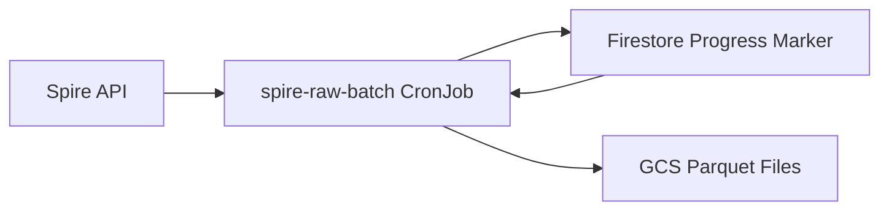

# Spire Raw Batch Service

A Kubernetes cron job that fetches aircraft position data from the Spire API and stores it as Parquet files in Google Cloud Storage.

## What This Service Does

This service replaces the legacy raw Spire scraper and runs every 5 minute to:
1. Fetch aircraft position data from Spire API
2. Process data in 5-minute windows
3. Store data as Parquet files in GCS bucket
4. Track progress using Firestore timestamps

## Architecture Flow



## Setup Instructions

### 1. Environment Variables
```bash
SPIRE_API_TOKEN=your_spire_token
FIRESTORE_STATE_DB=flights-pipeline-dev
FIRESTORE_STATE_COLLECTION=state
FIRESTORE_STATE_DOC_ID=spire-raw-batch
GCS_BUCKET_NAME=contrails-301217-spire-raw-batch-dev
LOG_LEVEL=INFO
```

### 2. Firestore Setup
Firestore document with timestamp look like:
```json
{
  "last_sync_end_at": "2025-01-01T00:00:00Z"
}
```

### 3. GCS Bucket
Dev GCS bucket: `contrails-301217-spire-raw-batch-dev`
Prod GCS bucket: `contrails-301217-spire-raw-batch`

## How It Works

### Data Processing
- Schedule: Runs every 5 minutes

### File Organization
- Format: `YYYYMMDD-HHMMSS.pq`
- Location: Flat structure in GCS bucket root
- Example: `20250117-212000.pq`

### Progress Tracking
- Firestore: Stores `last_sync_end_at` timestamp
- Checkpoint: Updated after successful GCS write
- Warning: Alerts if >1 hour behind schedule


## Monitoring & Troubleshooting

### Health Checks
- Progress marker: Check Firestore `last_sync_end_at` timestamp
- File count: Monitor GCS bucket for new Parquet files
- Cron status: Verify Kubernetes CronJob is running
